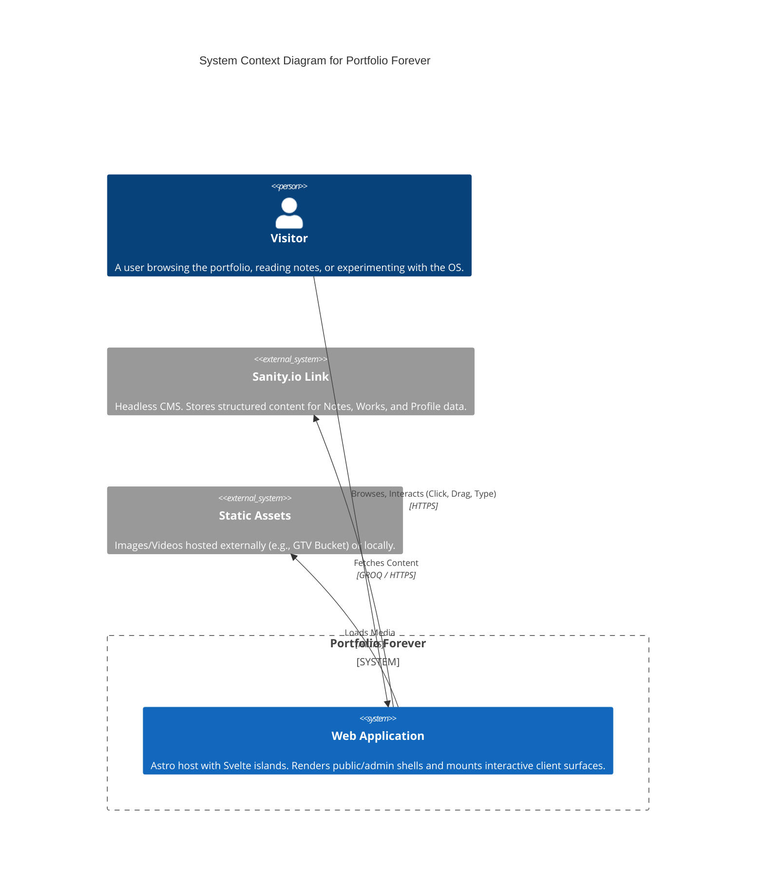
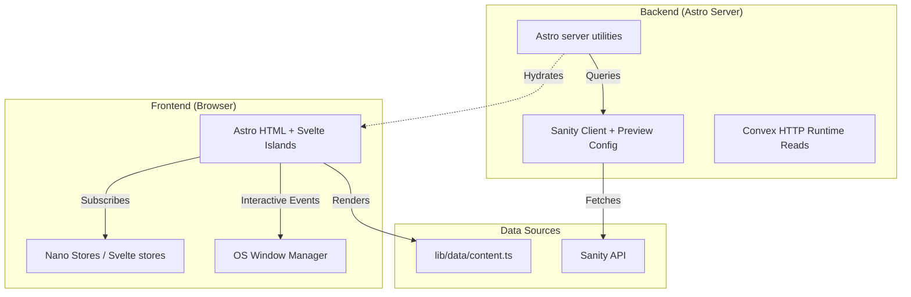

# System Engineering Architecture Breakdown

## 1. High-Level System Context

The **Portfolio Forever** system is a static-first, progressive web application designed to serve as a personal digital garden, portfolio, and experimental OS playground. It now uses **Astro** as the sole production host, with **Svelte islands** for interactive surfaces and **Sanity.io** for structured content management.

## 2. Container Architecture

The application focuses on a clear separation of concerns between **Static Data** (hardcoded for reliability/performance) and **Dynamic Content** (Sanity for easy updates).

## 3. Key Subsystems

### 3.1 Layout & Navigation Orchestration
The Astro shell (`src/layouts/BaseLayout.astro`) acts as the central coordinator for the public application shell.

- **Command Palette**: Listens for global keydown events (`/` or `?`) to trigger.
- **WIP Banner**: Conditionally rendered based on `layout-config`.
- **Terminal Footer**: Displays current route context and system status.

### 3.2 The OS Mode (`/os`)
An experimental route that breaks out of the standard web document flow into a window-manager paradigm.

- **State**: Fully client-side.
- **Persistence**: Ephemeral (resets on refresh).
- **Interactions**: Drag-and-drop, Focus Z-Index management.

### 3.3 Data Layer
- **Static**: `src/lib/data` contains `content.ts` for highly stable data (CV, Config).
- **Dynamic**: `src/lib/sanity` handles API connections for frequently updated content (Notes).

## 4. Directory Structure Map

| Directory | Purpose | Key Role |
|-----------|---------|----------|
| `src/lib/components` | Reusable UI | Atoms & Molecules (AsciiDonut, Video) |
| `src/lib/server` | Content/runtime reads | Sanity + Convex server adapters |
| `src/pages` | Astro routes | Public routes + `/admin` host |
| `src/routes` | Legacy parity layer | Reused Svelte route modules only where Astro mounts them |
| `src/lib/sections` | Interactive route sections | Hydrated Svelte implementations |
