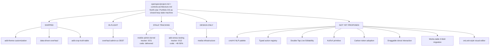

# Portfolio OS — Grounding Recon

**Date:** 2026-04-15
**Branch:** `feat/theme-overhaul`
**Base commit:** `564f2ba`
**Mode:** read-only audit — no code or existing docs modified
**Produced by:** 5 parallel Explore agents (vision, openspec audit, admin delivery, Convex data layer, user-facing pages)

A point-in-time snapshot of what has been delivered vs what has been promised. This is the *grounding layer* for a later idea-refine Phase 3 one-pager and openspec proposal; do not treat it as a plan.

---

## TL;DR — the five findings that matter

1. **The north-star already exists in the repo.** `openspec/project.md` + `openspec/controls-architecture.md` define "statement piece portfolio as closed-loop state machine" with Control Theory, TimeDepthController (5-min / 15-min / Full Archive), moddable blocks, and **Double-Tap Live Editability** as a *named primitive*. The cmd+K vision is an execution of an already-authored idea, not a new one.
2. **Openspec tracking is stale — reality is ahead.** 3 changes fully shipped (`add-theme-customization`, `data-driven-overhaul`, `add-crop-truth-table`), 1 at 95% (`overhaul-admin-ux`), and `mobile-admin-kernel` shows 0/21 in `tasks.md` *but its major architectural components already exist in `src/lib/admin/`*. Same pattern for `add-stress-testing`: framework in place, ~40–50% of test coverage delivered, tracker says 0/12.
3. **The Portfolio OS backbone is already production data.** 28+ Convex tables including `pages`, `sectionRegistry`, `themes`, `adminHistory`, `heroConfig`, `siteConfig` — the data contracts for a page-first, data-driven OS exist today.
4. **The ASCII donut already renders.** `src/lib/sections/HeroSection.svelte:68-69` conditionally mounts `<AsciiDonut />` via `heroConfig.showDonut`. But it is **static** — no click-drag / pointer rotation. The signature "draggable donut" interaction is the genuinely new bit.
5. **Works-table is ~60% ready for the MVP slice.** `worksEntries` has `title`, `url`, `year`, `month`, `styleOverrides.accentColor`. Missing: `customLinkText`, `httpColor`, `secondaryHighlight`. A 3-field schema migration closes the gap.

---

## Methodology

Five parallel Explore agents, dispatched in a single message, all read-only:

| Agent | Scope |
|---|---|
| A | Vision & control plane (`openspec/project.md`, `openspec/controls-architecture.md`) |
| B | Openspec change audit (all 7 in `openspec/changes/`) |
| C | Admin UX delivery vs `overhaul-admin-ux`, `mobile-admin-kernel`, `data-driven-overhaul` |
| D | Convex data layer (`convex/schema.ts`, all `convex/*.ts`) |
| E | User-facing pages (works, hero, theme tokens, stress-testing infra) |

---

## 1. North-star & control plane (Agent A)

From `openspec/project.md:3-4`:

```
Staff-level creative technologist portfolio showcasing design, engineering,
and art work. Targets senior positions at studios like Pentagram, Apple,
baek+baek. The medium is the message — the portfolio itself demonstrates craft.
```

From `openspec/controls-architecture.md`:

- **Controls Array** (`:12`) — global inputs that re-render DOM and mutate physics loops
- **TimeDepthController** (`:14`) — 5-Minute / 15-Minute / Full Archive depth modes
- **ThemeController** (`:25`) — CSS custom property swap, brutalist/minimalist, algorithmic WCAG AAA contrast validation
- **MotionController** (`:30`) — physics engines for layout transitions, toggle-able "Little Aliens" embellishments
- **Moddable Blocks** (`:40`) — HeroPositioningBlock, OutcomeBlock, MetadataBlock, GenericListBlock; each supports **Double-Tap Live Editability** via "clean, typed Direct Data Feeds"
- **The Plant** (`:49`) — Tailwind box model + golden-ratio scalars, 320px → 6K fidelity
- **Validation Loop** (`:56`) — Playwright POM + axe-core contrast validation
- **Combinatorial validator** (`:58`) — control combinations (e.g. 5-Minute + Night Vision + Fluid Physics) are treated as a *constraint satisfaction problem* requiring absolute reliability

### Named commitments and non-goals

- Static site — no server-side runtime (`project.md:48`)
- WCAG AA minimum, AAA for accessible theme (`project.md:51`)
- Control Theory as law — "closed-loop state machine" (`controls-architecture.md:4`)
- `/cv` route explicitly carves out an exception for PDF embedding (`controls-architecture.md:65`)
- Archival routes are hidden in 5-Minute mode (`controls-architecture.md:19`)
- Not a "static HTML stream" or "archive of vibes" (`controls-architecture.md:4`)

**Implication for cmd+K design:** actions can't just fire — they must pass a combinatorial validator *and* respect the static-site commitment. An LLM call is not trivially compatible with "no server-side runtime" unless the proposal explicitly routes through a Convex action (which is arguably not the same kind of "runtime" the doc forbids).

---

## 2. Openspec delivery audit (Agent B)

| Change | Intent (1 sentence) | Done/Total | Status |
|---|---|---|---|
| `add-theme-customization` | 5 accessibility-focused color palettes + 9 typefaces with live switching and footer attribution | **19/19** | ✅ SHIPPED |
| `data-driven-overhaul` | Remove hardcoded content; admin CRUD across all sections; hero ASCII toggles; data-driven CV | **7/7** | ✅ SHIPPED |
| `add-crop-truth-table` | Focal-point image crop configurator with 4-ratio preview grid and interactive crosshair | **8/8** | ✅ SHIPPED |
| `overhaul-admin-ux` | Home card pin, breakpoint controls, flags pagination, component standardization, change tracking, history popover | **35/37** | ⚠️ IN-FLIGHT (95%) — blocked on `lastModified` field + test audit |
| `add-stress-testing` | Playwright interaction/responsive/theme tests + Storybook component isolation across 16 routes | **0/12** | ⚠️ NOT STARTED per `tasks.md` — **see Delta 2** |
| `mobile-admin-kernel` | Mobile-first admin kernel: PageBar + SectionCompartment + 3-bookmark tabs (Content/Style/Layout) + PreviewDrawer | **0/21** | ⚠️ NOT STARTED per `tasks.md` — **see Delta 1** |
| `media-infrastructure` | Color-accurate photo pipeline (ICC, AVIF/WebP/JPEG) + Mux video + GIF/Lottie + project showcases + Common Lisp DSL | **— (no `tasks.md`)** | ⚠️ DESIGN-ONLY |

---

## 3. Critical deltas (where tracking ≠ reality)

These are the two biggest surprises. Both must be resolved before writing new proposals.

### Delta 1 — `mobile-admin-kernel` is effectively delivered but not tracked

Agent C's file-level audit found all major architectural pieces in `src/lib/admin/` with file:line citations:

- `BookmarkTabs.svelte:10-14, :28-38` — keyboard-nav tabs (arrow keys)
- `SectionCompartment.svelte:42-50` — accordion with collapsed/expanded states
- `ContentBookmark.svelte:43-80` — registry-driven editor dispatch, imports 12 section editors
- `StyleBookmark.svelte` — typography (size/weight/tracking/leading/wrap) + color + animation
- `LayoutBookmark.svelte:15-51` — visibility toggle, spacing presets, box model diagram, section ordering
- `PreviewDrawer.svelte` — bottom-sheet with grab handle, touch drag, 120ms animations, iframe dismiss
- `PageBar.svelte:1-48` — pills with section / entry counts
- `GlobalCompartment.svelte` — feature flags, site mode, nav mode, parallax speed

Yet `openspec/changes/mobile-admin-kernel/tasks.md` reports 0/21 done.

**Interpretation:** work landed under `overhaul-admin-ux` or `data-driven-overhaul` and was never checked off against the `mobile-admin-kernel` change. **Options:**

1. **Archive** `mobile-admin-kernel` with a "delivered under other changes" note — cleanest
2. **Re-audit** `tasks.md` against real code and check off what's actually done — most accurate historical record
3. **Re-scope** `mobile-admin-kernel` to only the real gaps (e.g. feature-flag visual indicators, which Agent C flagged as PARTIAL)

### Delta 2 — `add-stress-testing` is infra-complete, content-partial

Agent E found:

- `playwright.config.ts:78-150` — 9+ projects configured (chromium, firefox, webkit, mobile chrome, mobile safari, tablet, visual-regression, accessibility, responsive variants)
- 23 `.spec.ts` files across `tests/e2e/`, `tests/interaction/`, `tests/responsive/`, `tests/accessibility/`, `tests/visual/`
- `tests/e2e/theme-and-fonts.spec.ts` — 232 lines, comprehensive, keyboard T-key + persistence covered
- **Empty directories**: `tests/responsive/tablet/`, `tests/responsive/desktop/` — declared in config, zero spec files
- **Storybook ghost town**: `.storybook/main.ts` configured, only `src/lib/components/Toast.stories.ts` exists (proposal promised stories for ThemeSwitcher, FontSwitcher, CommandPalette, Elevator, AsciiDonut)

Reality is ~40–50% delivered, not 0%. **Options:**

1. **Re-scope** the change to only the tablet/desktop responsive suites + Storybook backfill
2. **Re-audit** `tasks.md` and mark what's done

---

## 4. Convex schema inventory (Agent D)

**28+ tables.** Grouped by function:

- **Content tables:** `cvEntries`, `cvLanguages`, `cvProfile`, `cvSections`, `academicEntries`, `worksEntries`, `talksEntries`, `blogPosts`, `galleryItems`, `labEntries`, `minorEntries`, `likesCategories`, `heroCaseStudies`
- **Configuration tables:** `siteConfig`, `heroConfig`, `featureFlags`, `thumbnailConfig`, `displayConfig`, `processConfig`, `osConfig`, `giftsConfig`, `terminalConfig`
- **Platform tables:** `pages`, `sectionRegistry`, `themes`, `adminHistory`, `githubProjects`

**Function files:** `works.ts`, `blog.ts`, `cv.ts`, `academia.ts`, `hero.ts`, `heroCaseStudies.ts`, `pages.ts`, `sectionRegistry.ts`, `themes.ts`, `siteConfig.ts`, `adminHistory.ts`, `display.ts`, `thumbnails.ts`, `gallery.ts`, `labs.ts`, `likes.ts`, `minor.ts`, `talks.ts`, `gifts.ts`, `process.ts`, `os.ts`, `terminal.ts`, `github.ts`, `languages.ts`, `seed.ts`, `seedAll.ts`.

Each content table follows the standard CRUD pattern: `getVisible*`, `getFull*`, `createEntry`, `updateEntry`, `deleteEntry`, `toggleVisibility`, `reorderEntries`.

**The Portfolio OS backbone already lives in data:** `pages` + `sectionRegistry` + `themes` + `adminHistory` + `siteConfig`. Any cmd+K action registry should bind to these tables directly.

### Works-table readiness for MVP

| MVP field (user spec) | Exists? | Current name | Notes |
|---|---|---|---|
| Date | ✅ | `year`, `month` | split, both optional number |
| Name | ✅ | `title` | string, required |
| Link / URL | ✅ | `url` | string, required |
| Custom link text | ❌ | — | needs `customLinkText?: string` |
| Stripe color | ⚠️ partial | `styleOverrides.accentColor` | single accent slot; semantics unclear — see Open Question 4 |
| HTTP color | ❌ | — | needs `styleOverrides.httpColor?: string` |
| Secondary highlight | ❌ | — | needs `styleOverrides.secondaryHighlight?: string` |

**Verdict:** 3–4 optional-field schema migration unlocks the "first page editable" slice.

### Missing tables vs `media-infrastructure` proposal

- `mediaAssets` (promised: type, url, srcset, blurPlaceholder, colorProfile, exif, chapters, posterUrl, width, height, fileSizeBytes) — **not in schema**
- `projectShowcases` (promised: slug, title, media array, tier, captureType) — **not in schema**
- `photoCollections` (promised: slug, title, assetIds array) — **not in schema**

Media infrastructure is a full greenfield data layer addition, not an enhancement.

---

## 5. User-facing delivery status (Agent E)

### Works page — DELIVERED

- `src/routes/works/+page.svelte:11` → renders `WorksSection`
- `src/lib/sections/WorksSection.svelte:26-53` — full `Project` interface (title, url, category, preview, previewMode, viewport, cam, objectPosition, focalX, focalY, zoom)
- `src/lib/admin/WorksAdmin.svelte:74-100` — full CRUD: createEntry, updateEntry, deleteEntry, toggleVisibility, reorderEntries
- `CropTruthTable.svelte` integrated at `WorksAdmin.svelte:256-266`
- Live Convex subscription: `WorksSection.svelte:105-114` subscribes to `api.works.getVisibleWorks` + `api.thumbnails.getConfig`

### Hero / landing — DELIVERED (static)

- `src/routes/+page.svelte:12` → `OnePageView`
- `src/lib/sections/HeroSection.svelte:68-69` — `<AsciiDonut />` and `<AsciiWave />` conditionally rendered via `showDonut` / `showWave` from `heroConfig`
- `src/lib/sections/HeroSection.svelte:53` — `hero--diptych`, `hero--editorial`, `hero--stacked` layout classes confirmed (matches commit `f904c32`)
- **NOT delivered:** pointer / drag interaction on the donut. Static render only.

### Theme system — DELIVERED (exceeds spec)

- `src/app.css:10-500+` — full CSS custom property token system:
  - Color (`--color-bg`, `--color-text`, `--color-accent`, `--color-success`, `--color-danger`)
  - Typography (`--font-size-*`, `--font-weight-*`, `--line-height-*`, `--letter-spacing-*`)
  - Spacing (`--space-unit` → `--space-6xl`)
  - Borders, shadows, radius
- **5 themes** via `[data-theme="..."]` selectors: `minimal`, `studio`, `terminal`, `darkroom`, `accessible`
- `app.css:7` imports 7 font families (Inter, JetBrains Mono, Crimson Pro, Fira Code, Space Grotesk, Rubik, IBM Plex Mono)
- `tests/e2e/theme-and-fonts.spec.ts:102-116` verifies theme persistence; `:187-201` verifies font persistence

### Stress-testing infra — PARTIAL

See Delta 2 above. Framework done, mobile tests done, tablet/desktop/Storybook hollow.

---

## 6. What's genuinely new work for the cmd+K + visual-editor vision

Based on the audit, these are the pieces that **do not exist** in the repo today:

1. **cmd+K NLP palette** — no command palette in `src/lib/` or `src/routes/admin/`
2. **LLM → typed action registry** — not built; `fengari-web` installed but unused (grep confirms no import sites found by agents)
3. **"Double-Tap Live Editability"** as a primitive — *named* in `controls-architecture.md:40` but not implemented. Existing editability lives in `/admin`, not inline.
4. **KaTeX primitive** — not in `package.json`, not in components
5. **Carbon Design System tokens** — not in `package.json`; would conflict or duplicate with existing `src/app.css` token system (see Open Question 3)
6. **Draggable ASCII donut** — donut renders; pointer interaction missing
7. **Works-table schema extension** — 3–4 optional fields (`customLinkText`, `httpColor`, `secondaryHighlight`, possibly rename/split `accentColor` → `stripeColor`)
8. **onLook-style visual tree editor** — referenced in the interview; not in repo

---

## 7. Delivery status map



---

## 8. Open questions surfaced by the audit

1. **`mobile-admin-kernel` disposition** — archive with a delivery note, re-audit `tasks.md` against real code, or re-scope to the gap features only?
2. **`add-stress-testing` disposition** — same fork: re-audit or re-scope?
3. **Carbon vs existing token system** — `src/app.css` already has a rich token system with 5 themes and WCAG AAA validation. Full Carbon adoption (answered in the interview) would either replace this (losing the control-theory contrast machinery) or run parallel (duplication). This directly contradicts existing delivered work and needs a tie-break before any proposal.
4. **`styleOverrides.accentColor` semantics** — is this the "stripe" color the user named, or a general accent? If general, the migration adds 4 fields instead of 3 (or renames).
5. **Static-site constraint vs cmd+K LLM calls** — `project.md:48` says "no server-side runtime." Options: (a) client-only LLM (cost/latency), (b) Convex action as LLM proxy (likely compatible — Convex actions aren't the "server runtime" the doc forbids, which reads more like SSR/Node server), (c) explicit waiver for admin-only endpoints.
6. **`fengari-web`'s role** — installed but with zero import sites found in the audit. Either vestigial (delete) or infrastructure awaiting a wiring proposal. Before any cmd+K proposal commits to Lua, resolve this.
7. **Combinatorial validator** — `controls-architecture.md:58` treats control combinations as a constraint satisfaction problem. Does this mean cmd+K actions need to pass a validator before firing, or is that a separate layer entirely?

---

## 9. Not a plan — just options on the table

- Resolve Deltas 1 & 2 by re-auditing `mobile-admin-kernel` and `add-stress-testing` against real code
- Pick a Carbon disposition (full / tokens-only / reject) — currently in tension with delivered work
- Grep `fengari-web` usage and decide its fate
- Write the `idea-refine` Phase 3 one-pager once the above are answered
- Scaffold `openspec/changes/works-command-os/` for the works-page + cmd+K slice (the lowest-risk shippable new work)

This document is the grounding layer. Nothing above commits to a direction.

---

# Decisions log (appended 2026-04-15)

## Correction: fengari-web is NOT vestigial — it's the pixel engine's Lua runtime

Agent D reported zero import sites. Direct grep contradicts that:

- `src/lib/pixel-engine/lua-runtime.ts` — the fengari bridge. Compiles Lua `update(dt, self, ctx)` scripts into entity-behavior functions. Exports `loadLuaRuntime()`, `compileBehavior(scriptSource)`.
- `src/lib/pixel-engine/fengari-web.d.ts` — TypeScript types
- `vite.config.ts` — build config references it
- **Consumers:** `src/routes/+layout.svelte`, `src/lib/components/PixelCanvas.svelte`, `src/lib/admin/PagePanel.svelte`, `src/lib/admin/SectionBuilder.svelte`, `src/lib/admin/UiSettingsPanel.svelte`, `src/lib/admin/FeatureFlagsAdmin.svelte`, `src/lib/admin/controls/FlagsCell.svelte`, `src/lib/admin/constants.ts`

Fengari is the **Lua scripting runtime for the pixel engine's entity behaviors** — almost certainly the "Little Aliens" toggle-able decorative physics layer named in `controls-architecture.md:34`. Lua scripts receive entity state (`x, y, vx, vy, width, height`) and engine context (`scrollY, scrollVelocity, mouseX, mouseY, viewportW, viewportH`) every frame. This is load-bearing creative-coding infrastructure, not dead weight.

**Implication for cmd+K:** no architectural conflict whatsoever. Lua scripts entity behaviors in the pixel engine; cmd+K operates on structured admin mutations. They occupy orthogonal dimensions. The LLM → typed TS action registry proceeds as planned; fengari stays untouched in `pixel-engine/`.

**Closes Open Question 6** (fengari disposition): keep, no action needed.

---

## Decisions captured from interview

### D1 — `mobile-admin-kernel`: re-scope to gap features

Do not archive. Do not historically re-audit. Rewrite `openspec/changes/mobile-admin-kernel/tasks.md` to cover only the real gaps that Agent C flagged:

- **Feature-flag visual indicators** — flags currently render with ON/OFF toggles but lack live visual feedback of what they control on the site (proposal originally called for green-dot / bar-state indicators)

Everything else in the original `mobile-admin-kernel` scope (BookmarkTabs, SectionCompartment, PreviewDrawer, PageBar, GlobalCompartment, StyleBookmark, LayoutBookmark, ContentBookmark, 44px touch targets, strict CSS dividers) is treated as delivered under `overhaul-admin-ux` / `data-driven-overhaul`. No tracking backfill.

### D2 — `add-stress-testing`: re-scope to gap features

Rewrite `openspec/changes/add-stress-testing/tasks.md` to cover only:

- **Responsive suite backfill** — populate `tests/responsive/tablet/` and `tests/responsive/desktop/` (both declared in `playwright.config.ts:142-150`, both currently empty)
- **Storybook backfill** — stories for `ThemeSwitcher`, `FontSwitcher`, `CommandPalette`, `Elevator`, `AsciiDonut` (today only `src/lib/components/Toast.stories.ts` exists)
- **Optional:** overlap detector programmatic tests (utility exists per Agent E but is untested)

The mobile / theme / e2e / accessibility / visual-regression / keyboard-shortcut infrastructure all count as delivered; do not re-plan any of it.

### D3 — Carbon Design System as an additional theme, not a replacement

Do not touch the existing 5-theme system in `src/app.css` (`minimal`, `studio`, `terminal`, `darkroom`, `accessible`). Add Carbon as the 6th theme via the existing `[data-theme="..."]` mechanism:

- New `[data-theme="carbon"]` selector block in `src/app.css` using **IBM Plex Sans / IBM Plex Mono** + Carbon color tokens + Carbon grid spacing
- New row in the Convex `themes` table via `themes.upsert({ themeId: "carbon", label: "Carbon", type: "...", colors, fonts, spacing, borders, isBuiltIn: true, isDefault: false })`
- Theme switcher in admin picks it up automatically via the existing registry — zero new UI
- Carbon becomes selectable per-page via `pages.themeOverrides` alongside all other themes
- The existing WCAG AAA contrast machinery in `ThemeController` applies to Carbon's palette identically

This **elegantly resolves the Carbon-vs-existing-tokens tension**: Carbon is one option among six, not a replacement of delivered work. The user's framing was exactly right — "it's easy, you just re-design it around it."

**Closes Open Questions 1, 2, and 3.**

### D4 — cmd+K command language: pure typed TypeScript. No Ruby. No new Lua bridge.

The user said "or use ruby if you want up to you" — delegating the call. Here's the call.

**No Ruby.** Adding a Ruby runtime to a browser SvelteKit app means shipping another VM:
- `mruby-wasm`: ~500 kB gzipped of pure VM weight
- Opal (Ruby → JS transpile): entire Ruby stdlib surface, heavy bundle
- Natalie (Ruby → C++): not browser-native at all

All three add weight with no offsetting benefit. The user explicitly said "I'm not gonna write in Lua [or Ruby] myself" — the value of a full language runtime is only unlocked if *humans* write in it. An LLM emitting Ruby is strictly worse than an LLM emitting a typed function call.

**No new Lua bridge for cmd+K.** Lua is already load-bearing in `src/lib/pixel-engine/` for entity-behavior scripting (see the fengari correction above). Wiring a *second* Lua binding for admin commands would blur two domains that should stay separate: creative-physics scripting vs. administrative mutations. Cross-contamination would make both harder to reason about.

**Decision: the cmd+K action registry is pure TypeScript with schema validation.** Concretely:

- Every admin-addressable operation is a TypeScript function with a **Zod** (or Valibot) schema describing its arguments
- The registry is a single object literal: `{ [actionName]: { description, parameters: zodSchema, execute: async (args, ctx) => ... } }`
- The LLM receives the JSON Schema form of the registry via Anthropic/OpenAI tool-calling — this is how "deterministic LLM" is actually enforced (the model physically cannot emit anything the schema doesn't allow)
- Validation runs at the boundary *before* `execute` fires — never trust model output
- Actions bind directly to Convex mutations (`works.updateEntry`, `themes.upsert`, `pages.updateSectionConfig`, etc.) so realtime propagation is automatic
- **Lua remains available as an escape hatch** via the existing `pixel-engine/lua-runtime.ts` *if* a future power-user command needs dynamic scripting — but it is emphatically not the primary command language

**Why this is the right call:**

- Zero added runtime weight — TypeScript and Zod are already in the stack
- Editor autocomplete, type-checking, refactor-safe
- Determinism is enforced by schema, not prompt discipline
- Matches the user's own "batteries-included + deterministic LLM" framing
- Keeps the creative layer (pixel engine / Lua) and the mutation layer (cmd+K / TS) orthogonal

**Closes the command-language thread.**

---

## Still open

### Open Question 5 — static-site constraint vs LLM calls

`openspec/project.md:48` commits to "no server-side runtime." An LLM-driven cmd+K palette needs one of:

- **(a) Client-only LLM** — unworkable: API key exposure, latency, cost
- **(b) Convex action as LLM proxy** — Convex actions run on Convex infrastructure, not a Node/SSR server. Arguably compatible with the spirit of "no server runtime" (the constraint reads as "the public portfolio is a static artifact," not "admin has no backend")
- **(c) Explicit waiver** of the constraint for admin-only endpoints

**Recommendation: (b).** Convex actions are the correct home for LLM calls — authenticated, already in the stack, and the `/admin` surface is fundamentally backend-facing work that shouldn't be hobbled by a public-site constraint. But this needs explicit sign-off because it's a de facto constraint waiver.

### Open Question 4 — RESOLVED: `worksEntries.styleOverrides` shape confirmed

Direct read of `convex/schema.ts:76-105` confirms the full `worksEntries` shape. The `styleOverrides` object currently has exactly three optional fields:

```ts
styleOverrides: v.optional(v.object({
    accentColor: v.optional(v.string()),
    badgeStyle: v.optional(v.string()),
    impactMetrics: v.optional(v.array(v.object({
        label: v.string(),
        value: v.string(),
    }))),
}))
```

**Decision:** interpret existing `accentColor` as the stripe color (no rename — additive only, backwards-compatible). The works-table MVP migration is purely additive, 3 new optional fields:

1. `linkLabel?: string` — top-level, for the user-specified "custom link text"
2. `styleOverrides.httpColor?: string` — for the http highlight
3. `styleOverrides.secondaryHighlight?: string` — for the secondary highlight

**Bonus finding:** `styleOverrides.badgeStyle` and `styleOverrides.impactMetrics` already exist but are undocumented in any openspec proposal I audited — worth grep-verifying whether they're rendered anywhere before the MVP proposal commits to its spec.

**Closes Open Question 4.**


---

## Note on execution mode

The user's rule was "all read then append only not implementing." The decisions above are captured in this append. **Actually rewriting `openspec/changes/mobile-admin-kernel/tasks.md` and `openspec/changes/add-stress-testing/tasks.md` is editing existing files** — that's outside "append only."

Two options for the user to pick:

- **(i) Keep decisions in this doc only.** Rewrite the two `tasks.md` files later as an explicit implementation step.
- **(ii) Proceed to edit both `tasks.md` files now** based on decisions D1 and D2. Surgical, ~15–25 lines each, still no application code.

Same applies to the works-table 3-field schema migration (`convex/schema.ts` + `convex/works.ts`): decided in principle, but the actual edit is gated on the user's word.

