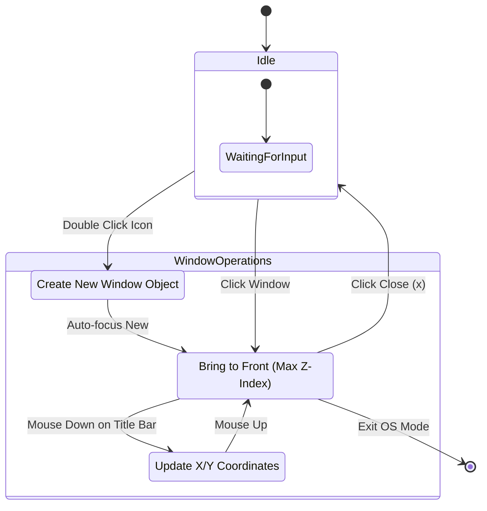
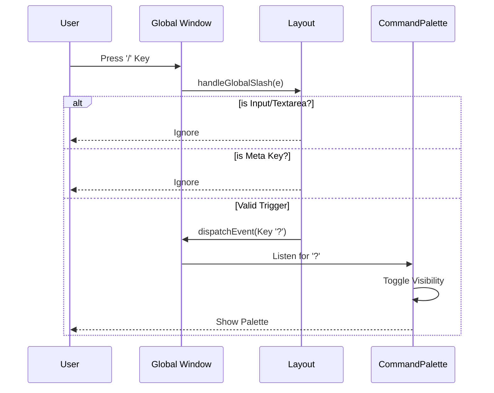

# State Diagrams & Logic Flows

## 1. OS Mode Window Management
The `/os` route implements a simplified window manager. This state machine governs how windows are opened, focused, and closed.



### Logic Breakdown
1. **Z-Index Strategy**: `getMaxZ() + 1` ensures the most recently interacted window is always on top.
2. **Drag Physics**: Delta-based movement `(CurrentMouse - InitialOffset)` prevents snapping artifacts.

## 2. Global Navigation & Mobile Menu
The responsive header transitions between an inline desktop view and a toggled mobile dropdown.

```mermaid
stateDiagram-v2
    direction LR
    
    state "Desktop View (> 1024px)" as Monitor {
        [*] --> InlineLinks
        InlineLinks --> [*]
    }

    state "Mobile View (<= 1024px)" as Mobile {
        [*] --> Collapsed
        
        state Collapsed {
           Status: Button shows '@'
        }
        
        state Expanded {
           Status: Button shows '×'
           List: Visible (Absolute Position)
        }

        Collapsed --> Expanded: Click Toggle
        Expanded --> Collapsed: Click Toggle
    }

    Note right of Mobile: handled by 'socialExpanded' boolean
```

## 3. Command Palette Activation
The "Terminal Hint" system listens for specific keystrokes to mimic a command-line interface.


