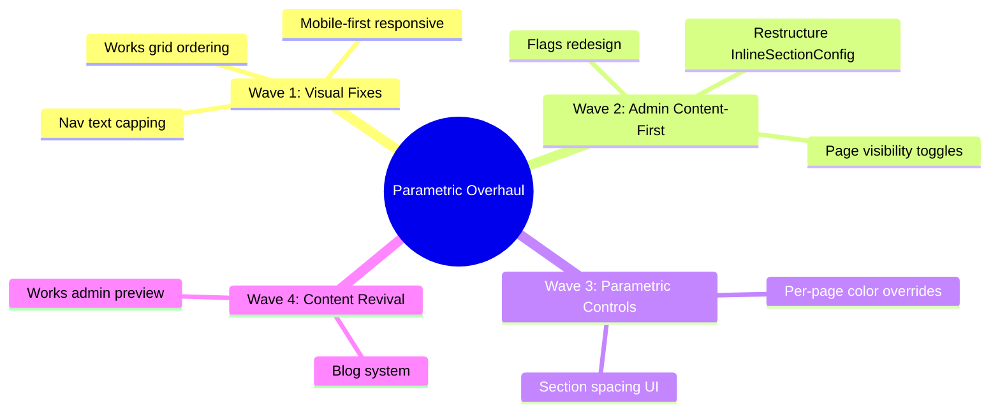

# Portfolio Parametric Overhaul - Implementation Plan

> **For agentic workers:** REQUIRED SUB-SKILL: Use superpowers:subagent-driven-development (recommended) or superpowers:executing-plans to implement this plan task-by-task. Steps use checkbox (`- [ ]`) syntax for tracking.

**Goal:** Fix visual bugs (growing nav, broken works grid), restructure admin for content-first editing, add page visibility controls, improve flags UX, revive blog, and establish parametric color/spacing control across all pages.

**Architecture:** Four waves of changes - (1) CSS/layout fixes for nav and works, (2) admin panel restructure prioritizing content over box model, (3) parametric control system for colors and spacing, (4) blog revival and missing content. Each wave produces a working, committable state.

**Tech Stack:** SvelteKit, Convex (backend), CSS custom properties, TypeScript

---



---

## Wave 1: Stop the Bleeding (Visual Fixes)

### Task 1: Cap fluid typography to sane maximums

**Files:**
- Modify: `src/app.css:30-41`

The `clamp()` max values are absurdly high (e.g. `--font-size-sm` maxes at 2.5rem, `--font-size-hero` at 28rem). On 4K+ displays the nav text grows unbounded.

- [ ] **Step 1: Fix fluid typography max values in app.css**

Replace lines 30-41 in `src/app.css`:

```css
/* === Fluid Typography — Modular Scale (golden ratio inspired) === */
--font-size-3xs: clamp(0.5rem, 0.46rem + 0.13vw, 0.625rem);
--font-size-2xs: clamp(0.563rem, 0.52rem + 0.18vw, 0.75rem);
--font-size-xs: clamp(0.688rem, 0.64rem + 0.2vw, 0.875rem);
--font-size-sm: clamp(0.813rem, 0.76rem + 0.25vw, 1rem);
--font-size-base: clamp(1rem, 0.95rem + 0.25vw, 1.25rem);
--font-size-lg: clamp(1.125rem, 1rem + 0.5vw, 1.5rem);
--font-size-xl: clamp(1.5rem, 1.25rem + 0.85vw, 2.25rem);
--font-size-2xl: clamp(2rem, 1.6rem + 1.3vw, 3rem);
--font-size-3xl: clamp(2.5rem, 1.95rem + 1.8vw, 4rem);
--font-size-4xl: clamp(3.25rem, 2.4rem + 2.6vw, 5rem);
--font-size-display: clamp(4rem, 2.8rem + 4.2vw, 8rem);
--font-size-hero: clamp(5rem, 3.5rem + 5.5vw, 12rem);
```

Key changes: max values capped to reasonable limits (sm: 1rem not 2.5rem, hero: 12rem not 28rem).

- [ ] **Step 2: Verify nav text size is stable at large viewports**

Open browser at full-width desktop (1920px+). Nav links should stay at ~14-16px, not grow beyond 1rem.

- [ ] **Step 3: Commit**

```bash
git add src/app.css
git commit -m "fix(typography): cap fluid clamp() max values to prevent unbounded growth

Nav text was growing to 2.5rem+ on large displays because clamp() max values
were set absurdly high. Capped all font sizes to reasonable maximums.

Co-Authored-By: Claude Opus 4.6 (1M context) <noreply@anthropic.com>"
```

---

### Task 2: Fix works ordering (renumber instead of swap)

**Files:**
- Modify: `src/lib/admin/WorksAdmin.svelte` (reorder function)

The current reorder swaps order VALUES (indices 0,10,5,3 become 10,0,5,3), causing gaps to accumulate and "random" ordering.

- [ ] **Step 1: Find WorksAdmin.svelte and read the reorder function**

```bash
# Locate the file
find src/lib/admin -name "WorksAdmin.svelte"
```

- [ ] **Step 2: Replace swap logic with sequential renumbering**

Find the `moveWorkEntry` function and replace it. Instead of swapping two entries' order values, move the entry to the new position and renumber all entries sequentially:

```typescript
async function moveWorkEntry(id: string, direction: -1 | 1) {
  const sorted = [...entries].sort((a: any, b: any) => a.order - b.order);
  const idx = sorted.findIndex((e: any) => e._id === id);
  const newIdx = idx + direction;
  if (newIdx < 0 || newIdx >= sorted.length) return;
  // Move element to new position
  const [moved] = sorted.splice(idx, 1);
  sorted.splice(newIdx, 0, moved);
  // Renumber all sequentially
  const updates = sorted.map((e: any, i: number) => ({ id: e._id, order: i }));
  await client.mutation(api.works.reorderEntries, { updates });
}
```

- [ ] **Step 3: Verify ordering in admin**

Open admin, go to Works. Reorder entries up/down. Entries should maintain clean sequential order (0,1,2,3...) after each move.

- [ ] **Step 4: Commit**

```bash
git add src/lib/admin/WorksAdmin.svelte
git commit -m "fix(works): renumber all entries sequentially on reorder

Was swapping order values between two entries, causing gaps to accumulate
and unpredictable ordering. Now renumbers the entire list on every move.

Co-Authored-By: Claude Opus 4.6 (1M context) <noreply@anthropic.com>"
```

---

### Task 3: Fix works grid responsive behavior

**Files:**
- Modify: `src/lib/sections/WorksSection.svelte:174-199`

Grid columns only applied at 768px+. List mode forces `flex-direction: row` on mobile. Need proper mobile-first responsive.

- [ ] **Step 1: Update works grid CSS for mobile-first responsive**

Replace the grid and list-mode CSS (around lines 174-199):

```css
.projects-grid {
  display: grid;
  grid-template-columns: 1fr;
  gap: var(--space-lg);
}

@media (min-width: 480px) {
  .projects-grid {
    grid-template-columns: repeat(min(var(--grid-cols, 2), 2), 1fr);
  }
}

@media (min-width: 768px) {
  .projects-grid {
    grid-template-columns: repeat(var(--grid-cols, 2), 1fr);
    gap: var(--space-xl);
  }
}

/* List mode */
.projects-grid.list-mode {
  grid-template-columns: 1fr;
}

.list-mode .project-card {
  gap: var(--space-sm);
}

@media (min-width: 600px) {
  .list-mode .project-card {
    flex-direction: row;
    align-items: center;
  }

  .list-mode .project-embed {
    max-width: 200px;
    flex-shrink: 0;
  }
}
```

- [ ] **Step 2: Verify at multiple viewport sizes**

Check at 320px (iPhone SE), 480px, 768px, 1024px, 1440px. Grid should show 1 col on mobile, up to `gridCols` on tablet+. List mode should stack vertically on mobile.

- [ ] **Step 3: Commit**

```bash
git add src/lib/sections/WorksSection.svelte
git commit -m "fix(works): mobile-first responsive grid with proper breakpoints

Grid columns now scale from 1 col on mobile to admin-configured columns
on desktop. List mode stacks vertically on phones instead of cramming
side-by-side.

Co-Authored-By: Claude Opus 4.6 (1M context) <noreply@anthropic.com>"
```

---

### Task 4: Mobile-first nav responsive pass

**Files:**
- Modify: `src/routes/+layout.svelte` (nav CSS, lines ~423-594)

Nav uses horizontal scroll on mobile instead of wrapping. Gap jumps from 4px to 24px at 768px.

- [ ] **Step 1: Replace nav responsive CSS**

Find the nav-related media queries in `+layout.svelte` `<style>` and update:

```css
/* Base (mobile-first) */
.nav {
  display: flex;
  flex-wrap: wrap;
  gap: var(--space-2xs) var(--space-xs);
  justify-content: center;
}

.nav-link {
  font-size: var(--font-size-xs);
  font-weight: var(--font-weight-medium);
  color: var(--color-text-secondary);
  text-transform: lowercase;
  padding: var(--space-2xs) 0;
  position: relative;
  transition: color var(--duration-fast) var(--easing);
  white-space: nowrap;
}

/* Tablet */
@media (min-width: 768px) {
  .nav {
    gap: var(--space-sm) var(--space-md);
  }
  .nav-link {
    font-size: var(--font-size-sm);
  }
}

/* Desktop */
@media (min-width: 1024px) {
  .nav {
    gap: var(--space-sm) var(--space-lg);
  }
}
```

Remove the `overflow-x: auto` mobile fallback (was at ~line 568) and the `max-width: 380px` font shrinking.

- [ ] **Step 2: Verify nav wraps cleanly on iPhone SE (320px) through desktop**

Nav should wrap to 2-3 lines on small phones, 2 lines on tablets, 1 line on desktop. No horizontal scrollbar.

- [ ] **Step 3: Commit**

```bash
git add src/routes/+layout.svelte
git commit -m "fix(nav): mobile-first wrapping instead of horizontal scroll

Nav now wraps naturally on small screens with graduated gap sizes.
Removed overflow-x scroll hack and ultra-tight font-size overrides.

Co-Authored-By: Claude Opus 4.6 (1M context) <noreply@anthropic.com>"
```

---

## Wave 2: Admin Content-First Overhaul

### Task 5: Restructure InlineSectionConfig - content first, box model secondary

**Files:**
- Modify: `src/lib/admin/InlineSectionConfig.svelte:183-340`

Currently: BoxModel (primary) > Visibility > Typography > ViewMode.
Target: Visibility > Content/Typography > ViewMode > BoxModel (collapsible).

- [ ] **Step 1: Reorganize the template in InlineSectionConfig.svelte**

Replace lines 183-340 with this reordered template:

```svelte
<div class="inline-config">
  <!-- 1. Visibility — always first -->
  <div class="config-row config-row--split">
    <span class="field-label">VISIBLE</span>
    <AdminToggle
      checked={visible}
      size="sm"
      color="green"
      label="Section visibility"
      on:change={toggleVisibility}
    />
  </div>

  <!-- 2. Content: Hero typography -->
  {#if sectionType === 'hero'}
    <div class="config-row">
      <div class="control-header">
        <span class="field-label">TYPOGRAPHY</span>
        <ChangeBadge
          timestamp={heroConfig?.lastModified ?? null}
          isDefault={isHeroDefault}
        />
        <ResetButton
          visible={!isHeroDefault}
          on:reset={resetHeroDefaults}
        />
      </div>
    </div>

    <div class="config-row">
      <AdminSlider
        label="SIZE"
        value={heroNameSize}
        min={2}
        max={12}
        step={0.5}
        width="fill"
        format={(v) => v + 'rem'}
        showReset={heroNameSize !== DEFAULTS.hero.heroNameSize}
        resetValue={DEFAULTS.hero.heroNameSize}
        on:change={(e) => setHeroConfig('heroNameSize', e.detail.value)}
      />
    </div>

    <div class="config-row">
      <span class="field-label">WEIGHT</span>
      <AdminChipGroup
        options={WEIGHT_OPTIONS}
        value={String(heroNameWeight)}
        on:change={(e) => setHeroConfig('heroNameWeight', parseInt(getSingleValue(e.detail.value), 10))}
      />
    </div>

    <div class="config-row">
      <AdminSlider
        label="TRACKING"
        value={heroNameLetterSpacing}
        min={-0.1}
        max={0.05}
        step={0.01}
        width="fill"
        format={(v) => v.toFixed(2) + 'em'}
        showReset={Math.abs(heroNameLetterSpacing - DEFAULTS.hero.heroNameLetterSpacing) > 0.001}
        resetValue={DEFAULTS.hero.heroNameLetterSpacing}
        on:change={(e) => setHeroConfig('heroNameLetterSpacing', e.detail.value)}
      />
    </div>

    <div class="config-row">
      <AdminSlider
        label="LEADING"
        value={heroNameLineHeight}
        min={0.8}
        max={2}
        step={0.05}
        width="fill"
        format={(v) => v.toFixed(2)}
        showReset={Math.abs(heroNameLineHeight - DEFAULTS.hero.heroNameLineHeight) > 0.01}
        resetValue={DEFAULTS.hero.heroNameLineHeight}
        on:change={(e) => setHeroConfig('heroNameLineHeight', e.detail.value)}
      />
    </div>

    <div class="config-row">
      <span class="field-label">WRAP</span>
      <AdminChipGroup
        options={WRAP_OPTIONS}
        value={heroNameTextWrap}
        on:change={(e) => setHeroConfig('heroNameTextWrap', e.detail.value)}
      />
    </div>

    <div class="config-row">
      <div class="control-header">
        <span class="field-label">HERO VISUALS</span>
      </div>
    </div>

    <div class="config-row config-row--split">
      <span class="field-label">ASCII DONUT</span>
      <AdminToggle
        checked={heroConfig?.showAsciiDonut ?? false}
        size="sm"
        color="green"
        label="Show ASCII Donut"
        on:change={() => setHeroConfig('showAsciiDonut', !(heroConfig?.showAsciiDonut ?? false))}
      />
    </div>

    <div class="config-row config-row--split">
      <span class="field-label">ASCII WAVE</span>
      <AdminToggle
        checked={heroConfig?.showAsciiWave ?? false}
        size="sm"
        color="green"
        label="Show ASCII Wave"
        on:change={() => setHeroConfig('showAsciiWave', !(heroConfig?.showAsciiWave ?? false))}
      />
    </div>
  {/if}

  <!-- 2b. Content: Non-hero typography controls -->
  {#if sectionType !== 'hero'}
    <div class="config-row">
      <TypographyControls
        fontSize={sectionFontSize}
        fontWeight={sectionFontWeight}
        letterSpacing={sectionLetterSpacing}
        lineHeight={sectionLineHeight}
        defaults={TYPOGRAPHY_DEFAULTS}
        on:change={(e) => setSectionTypography(e.detail.field, e.detail.value)}
        on:reset={resetSectionTypography}
      />
    </div>
  {/if}

  <!-- 3. View Mode (data-backed sections only) -->
  {#if isDataBacked}
    <div class="config-row">
      <span class="field-label">VIEW MODE</span>
      <AdminChipGroup
        options={VIEW_MODE_OPTIONS}
        value={viewMode}
        on:change={(e) => setViewMode(getSingleValue(e.detail.value))}
      />
    </div>
  {/if}

  <!-- 4. Spacing — collapsible, secondary -->
  <details class="spacing-details">
    <summary class="field-label spacing-summary">SPACING</summary>
    <div class="config-row" style="margin-top: 8px;">
      <BoxModelDiagram
        margin={boxMargin}
        padding={boxPadding}
        label={typeDef.label}
        on:change={handleBoxModelChange}
      />
    </div>
  </details>
</div>
```

- [ ] **Step 2: Add CSS for the collapsible spacing section**

Add to the `<style>` block:

```css
.spacing-details {
  border-top: 1px solid color-mix(in oklch, var(--bento-blue, #2563EB) 10%, transparent);
  padding-top: 8px;
  margin-top: 4px;
}

.spacing-summary {
  cursor: pointer;
  user-select: none;
  list-style: none;
  display: flex;
  align-items: center;
  gap: 4px;
}

.spacing-summary::before {
  content: '>';
  font-size: 7px;
  transition: transform 120ms ease;
}

.spacing-details[open] .spacing-summary::before {
  transform: rotate(90deg);
}

.spacing-summary::-webkit-details-marker {
  display: none;
}
```

- [ ] **Step 3: Verify in admin**

Open admin, expand a section config. Should show: Visibility toggle > Typography > View Mode > collapsible "SPACING" with box model inside.

- [ ] **Step 4: Commit**

```bash
git add src/lib/admin/InlineSectionConfig.svelte
git commit -m "feat(admin): content-first section config, box model now collapsible

Reordered InlineSectionConfig: visibility and typography are primary,
view mode next, box model spacing is now in a collapsible <details>
section at the bottom. Content editing > styling.

Co-Authored-By: Claude Opus 4.6 (1M context) <noreply@anthropic.com>"
```

---

### Task 6: Add page visibility toggle in sidebar

**Files:**
- Modify: `src/lib/admin/PageSidebar.svelte:97-163`
- Modify: `src/routes/admin/+page.svelte` (add handler)

Page dots are currently read-only indicators. Make them clickable to toggle page visibility.

- [ ] **Step 1: Add togglepage event to PageSidebar dispatch**

In `PageSidebar.svelte`, update the event dispatcher (line 9):

```typescript
const dispatch = createEventDispatcher<{
  selectpage: { pageId: string };
  newpage: void;
  toggleflag: { key: string; category: string };
  reorderpages: { pageIds: string[] };
  togglepage: { pageId: string; visible: boolean };
}>();
```

- [ ] **Step 2: Make page dots clickable**

Replace the page dot in the template (around line 145-151) with a clickable button:

```svelte
<button
  class="page-dot-btn"
  class:page-dot--visible={page.visible}
  class:page-dot--hidden={!page.visible}
  on:click|stopPropagation={() => dispatch('togglepage', { pageId: page.pageId, visible: !page.visible })}
  title={page.visible ? 'Click to hide page' : 'Click to show page'}
  aria-label={page.visible ? 'Hide ' + page.label : 'Show ' + page.label}
>
  <span class="page-dot" class:page-dot--visible={page.visible} class:page-dot--hidden={!page.visible}></span>
</button>
```

Do the same for the home card dot (around line 113-117):

```svelte
<button
  class="page-dot-btn"
  on:click|stopPropagation={() => dispatch('togglepage', { pageId: 'home', visible: !homePage.visible })}
  title={homePage.visible ? 'Click to hide page' : 'Click to show page'}
  aria-label={homePage.visible ? 'Hide Home' : 'Show Home'}
>
  <span
    class="home-card-dot"
    class:home-card-dot--visible={homePage.visible}
    class:home-card-dot--hidden={!homePage.visible}
  ></span>
</button>
```

- [ ] **Step 3: Add CSS for dot button**

```css
.page-dot-btn {
  background: none;
  border: none;
  padding: 4px;
  margin: -4px;
  cursor: pointer;
  border-radius: 50%;
  display: flex;
  align-items: center;
  justify-content: center;
}

.page-dot-btn:hover .page-dot,
.page-dot-btn:hover .home-card-dot {
  transform: scale(1.5);
  transition: transform 120ms ease;
}
```

- [ ] **Step 4: Handle togglepage event in +page.svelte**

In `src/routes/admin/+page.svelte`, add the handler and wire it up:

```typescript
async function handleTogglePage(e: CustomEvent<{ pageId: string; visible: boolean }>) {
  const { pageId, visible } = e.detail;
  const page = pages.find((p: any) => p.pageId === pageId);
  if (!page) return;
  await client.mutation(api.pages.upsert, {
    pageId: page.pageId,
    label: page.label,
    route: page.route,
    navOrder: page.navOrder ?? 0,
    navVisible: visible ? (page.navVisible ?? true) : false,
    visible,
    sections: page.sections ?? [],
  });
}
```

Wire it in the template where AdminShell is rendered, passing through to PageSidebar:
`on:togglepage={handleTogglePage}`

- [ ] **Step 5: Verify**

In admin sidebar, click a green dot. Page should go hidden (gray dot). Click again to restore.

- [ ] **Step 6: Commit**

```bash
git add src/lib/admin/PageSidebar.svelte src/routes/admin/+page.svelte
git commit -m "feat(admin): clickable page visibility dots in sidebar

Page dots in the sidebar are now buttons. Click to toggle page
visibility directly without navigating to the section builder.

Co-Authored-By: Claude Opus 4.6 (1M context) <noreply@anthropic.com>"
```

---

### Task 7: Redesign flags section - better placement and labels

**Files:**
- Modify: `src/lib/admin/PageSidebar.svelte:166-187, 405-457`

Flags are pinned to sidebar bottom (`margin-top: auto`), labels are tiny and unclear.

- [ ] **Step 1: Move flags above pages, add descriptions**

Restructure the template in PageSidebar.svelte. Move FLAGS section between Home card and PAGES section:

```svelte
<nav class="page-sidebar" aria-label="Admin pages">
  <!-- Home card — pinned above -->
  {#if homePage}
    <!-- ... existing home card ... -->
  {/if}

  <!-- FLAGS section — promoted above pages -->
  <div class="sidebar-section flags-section">
    <span class="admin-label admin-label--xs sidebar-heading">FLAGS</span>
    <div class="flags-list">
      {#each DEFAULT_FLAGS as flag}
        <button
          class="flag-item"
          class:flag-item--on={isFlagEnabled(flag.key)}
          on:click={() => dispatch('toggleflag', { key: flag.key, category: flag.category })}
          aria-label="Toggle {flag.label}"
          aria-checked={isFlagEnabled(flag.key)}
          role="switch"
          title={FLAG_DESCRIPTIONS[flag.key] ?? flag.label}
        >
          <span
            class="flag-dot"
            class:flag-dot--on={isFlagEnabled(flag.key)}
            class:flag-dot--off={!isFlagEnabled(flag.key)}
          ></span>
          <span class="flag-label">{flag.label}</span>
          <span class="flag-desc">{FLAG_DESCRIPTIONS[flag.key]?.split('(')[0]?.trim() ?? ''}</span>
        </button>
      {/each}
    </div>
  </div>

  <!-- PAGES section -->
  <!-- ... existing pages section ... -->
</nav>
```

- [ ] **Step 2: Update flags CSS - remove bottom pinning, use single column with descriptions**

Remove the old `margin-top: auto` on `.flags-section` and replace the grid layout:

```css
.flags-section {
  padding-top: var(--admin-space-3, 12px);
  border-bottom: 1px solid var(--border-color-subtle, #1a1a1a);
  padding-bottom: var(--admin-space-3, 12px);
  margin-bottom: var(--admin-space-2, 8px);
}

.flags-list {
  display: flex;
  flex-direction: column;
  gap: 1px;
}

.flag-item {
  display: flex;
  align-items: center;
  gap: var(--admin-space-2, 8px);
  padding: var(--admin-space-1, 4px) var(--admin-space-2, 8px);
  background: transparent;
  border: none;
  cursor: pointer;
  border-radius: 2px;
  transition: background var(--admin-transition, 120ms ease);
  text-align: left;
  width: 100%;
}

.flag-item:hover {
  background: var(--color-bg-alt, #111);
}

.flag-item--on {
  background: rgba(68, 214, 44, 0.04);
}

.flag-desc {
  font-family: var(--font-mono);
  font-size: 6px;
  color: var(--color-text-subtle, #444);
  margin-left: auto;
  white-space: nowrap;
  overflow: hidden;
  text-overflow: ellipsis;
  max-width: 80px;
}
```

- [ ] **Step 3: Verify**

Flags should appear between Home card and PAGES. Each flag shows its label and a short description. Clearer what each does.

- [ ] **Step 4: Commit**

```bash
git add src/lib/admin/PageSidebar.svelte
git commit -m "feat(admin): promote flags above pages with visible descriptions

Flags moved from bottom of sidebar to between home card and pages list.
Now shows short descriptions for each flag. Single column layout for
better readability.

Co-Authored-By: Claude Opus 4.6 (1M context) <noreply@anthropic.com>"
```

---

## Wave 3: Parametric Control System

### Task 8: Add per-page accent color control

**Files:**
- Modify: `src/lib/admin/InlineSectionConfig.svelte` (add color input at page level)
- Modify: `src/lib/admin/SectionBuilder.svelte` (add page-level color control)
- Modify: `src/lib/components/OnePageView.svelte` (apply color overrides)
- Modify: `convex/pages.ts` (ensure themeOverrides mutation handles accent color)

The schema already supports `pages.themeOverrides` (any type). We need UI to set `accentColor` and frontend to apply it.

- [ ] **Step 1: Add accent color picker to SectionBuilder page header**

In `src/lib/admin/SectionBuilder.svelte`, add a color input after the page status badges:

```svelte
<!-- Page accent color -->
<div class="page-accent">
  <label class="field-label" for="page-accent-color">ACCENT</label>
  <input
    id="page-accent-color"
    type="color"
    value={page?.themeOverrides?.accentColor ?? '#2563EB'}
    on:input={(e) => handleAccentChange(e.currentTarget.value)}
    class="accent-picker"
  />
  {#if page?.themeOverrides?.accentColor}
    <button class="accent-reset" on:click={() => handleAccentChange(null)} title="Reset to default">x</button>
  {/if}
</div>
```

Add the handler:

```typescript
async function handleAccentChange(color: string | null) {
  const themeOverrides = { ...(page?.themeOverrides ?? {}), accentColor: color };
  if (color === null) delete themeOverrides.accentColor;
  await client.mutation(api.pages.upsert, {
    pageId: page.pageId,
    label: page.label,
    route: page.route,
    navOrder: page.navOrder ?? 0,
    navVisible: page.navVisible ?? true,
    visible: page.visible ?? true,
    sections: page.sections ?? [],
    themeOverrides,
  });
}
```

- [ ] **Step 2: Apply page accent color in OnePageView**

In `src/lib/components/OnePageView.svelte`, where the page wrapper is rendered, apply the accent color as a CSS custom property:

```svelte
<div
  class="one-page-view"
  style:--color-accent={homePage?.themeOverrides?.accentColor ?? null}
>
```

- [ ] **Step 3: Add CSS for accent picker**

```css
.page-accent {
  display: flex;
  align-items: center;
  gap: 6px;
}

.accent-picker {
  width: 20px;
  height: 20px;
  padding: 0;
  border: 1px solid var(--border-color-subtle);
  border-radius: 2px;
  cursor: pointer;
  background: none;
}

.accent-picker::-webkit-color-swatch-wrapper {
  padding: 0;
}

.accent-picker::-webkit-color-swatch {
  border: none;
  border-radius: 1px;
}

.accent-reset {
  font-family: var(--font-mono);
  font-size: 8px;
  color: var(--color-text-subtle);
  background: none;
  border: none;
  cursor: pointer;
  padding: 2px 4px;
}

.accent-reset:hover {
  color: var(--color-danger);
}
```

- [ ] **Step 4: Verify**

In admin, select a page. Pick an accent color. The live preview should show the new accent color on links and interactive elements.

- [ ] **Step 5: Commit**

```bash
git add src/lib/admin/SectionBuilder.svelte src/lib/components/OnePageView.svelte
git commit -m "feat(admin): per-page accent color control

Added color picker to page header in admin. Selected color flows through
as CSS custom property --color-accent, overriding the theme default for
that page's scope.

Co-Authored-By: Claude Opus 4.6 (1M context) <noreply@anthropic.com>"
```

---

### Task 9: Section spacing quick presets

**Files:**
- Modify: `src/lib/admin/InlineSectionConfig.svelte`

The box model is now collapsible (Task 5), but spacing should also have quick presets for common values.

- [ ] **Step 1: Add spacing presets inside the collapsible details**

After the BoxModelDiagram inside the `<details>` element, add quick preset buttons:

```svelte
<details class="spacing-details">
  <summary class="field-label spacing-summary">SPACING</summary>
  <div class="config-row" style="margin-top: 8px;">
    <div class="spacing-presets">
      <span class="field-label">PRESETS</span>
      <div class="preset-chips">
        {#each [
          { label: 'none', top: 0, bottom: 0 },
          { label: 'sm', top: 16, bottom: 16 },
          { label: 'md', top: 32, bottom: 32 },
          { label: 'lg', top: 64, bottom: 64 },
          { label: 'xl', top: 96, bottom: 96 },
        ] as preset}
          <button
            class="preset-chip"
            class:preset-chip--active={boxMargin.top === preset.top && boxMargin.bottom === preset.bottom}
            on:click={() => applySpacingPreset(preset.top, preset.bottom)}
          >{preset.label}</button>
        {/each}
      </div>
    </div>
    <BoxModelDiagram
      margin={boxMargin}
      padding={boxPadding}
      label={typeDef.label}
      on:change={handleBoxModelChange}
    />
  </div>
</details>
```

- [ ] **Step 2: Add applySpacingPreset handler**

```typescript
async function applySpacingPreset(top: number, bottom: number) {
  await client.mutation(api.pages.updateSectionSpacing, {
    pageId,
    sectionIndex,
    spacingBefore: top,
    spacingAfter: bottom,
  });
}
```

- [ ] **Step 3: Add preset chip CSS**

```css
.spacing-presets {
  display: flex;
  flex-direction: column;
  gap: 4px;
  margin-bottom: 8px;
}

.preset-chips {
  display: flex;
  gap: 2px;
}

.preset-chip {
  font-family: var(--font-mono);
  font-size: 7px;
  text-transform: uppercase;
  letter-spacing: 0.08em;
  padding: 2px 6px;
  border: 1px solid var(--border-color-subtle);
  border-radius: 2px;
  background: transparent;
  color: var(--color-text-muted);
  cursor: pointer;
  transition: all 120ms ease;
}

.preset-chip:hover {
  border-color: var(--admin-blue, #2563EB);
  color: var(--admin-blue, #2563EB);
}

.preset-chip--active {
  background: var(--admin-blue, #2563EB);
  color: white;
  border-color: var(--admin-blue, #2563EB);
}
```

- [ ] **Step 4: Commit**

```bash
git add src/lib/admin/InlineSectionConfig.svelte
git commit -m "feat(admin): spacing presets (none/sm/md/lg/xl) in section config

Quick preset buttons for common spacing values inside the collapsible
spacing section. One click applies symmetric top+bottom margin.

Co-Authored-By: Claude Opus 4.6 (1M context) <noreply@anthropic.com>"
```

---

## Wave 4: Content Revival

### Task 10: Verify and fix blog data pipeline

**Files:**
- Modify: `src/routes/admin/+page.svelte` (ensure blog seed runs)
- Verify: `convex/seedAll.ts` (seedBlog function)
- Verify: `src/lib/sections/BlogSection.svelte` (rendering)

Blog shows "No notes yet" - need to verify the seed ran and blog admin works.

- [ ] **Step 1: Check if blog posts exist in Convex**

Open the Convex dashboard or run:
```bash
npx convex data blogPosts
```

If no posts exist, the seed may not have run.

- [ ] **Step 2: Verify seedBlog is called on admin mount**

Read `src/routes/admin/+page.svelte` onMount to confirm `seedAll.seedBlog()` is called. If it is, the issue may be that the seed guard (`if existing`) prevents re-seeding.

- [ ] **Step 3: If blog is empty, trigger a manual seed**

Add a temporary check in the admin page or run via Convex dashboard:
```typescript
// In admin onMount, add force flag or call directly
await client.mutation(api.seedAll.seedBlog, {});
```

- [ ] **Step 4: Verify blog renders posts**

Navigate to `/blog`. Should show the 3 seeded posts with titles, excerpts, dates.

- [ ] **Step 5: Test blog admin CRUD**

In admin, select Blog page. Add a new post via BlogAdmin. Verify it appears on `/blog`. Toggle visibility. Delete.

- [ ] **Step 6: Commit any fixes**

```bash
git add -A
git commit -m "fix(blog): ensure blog seed runs and posts are visible

Verified blog data pipeline end-to-end: seed → Convex → BlogSection render.
Fixed any issues preventing posts from appearing.

Co-Authored-By: Claude Opus 4.6 (1M context) <noreply@anthropic.com>"
```

---

### Task 11: Works admin - better visual preview cards

**Files:**
- Modify: `src/lib/admin/WorksAdmin.svelte`

Works admin needs better visual live-preview control. Currently shows expandable form fields but no visual preview of how cards look.

- [ ] **Step 1: Read the current WorksAdmin component**

```bash
# Find and read
cat src/lib/admin/WorksAdmin.svelte
```

- [ ] **Step 2: Add thumbnail preview to works admin entries**

For each works entry row, show a small preview thumbnail (if preview image exists):

```svelte
<!-- Inside each works entry row -->
<div class="works-entry-row">
  {#if entry.preview}
    <div class="works-thumb">
      
    </div>
  {:else}
    <div class="works-thumb works-thumb--empty">
      <span>no preview</span>
    </div>
  {/if}
  <!-- ... existing title, url, category fields ... -->
</div>
```

- [ ] **Step 3: Add works thumbnail CSS**

```css
.works-thumb {
  width: 48px;
  height: 32px;
  border-radius: 2px;
  overflow: hidden;
  flex-shrink: 0;
  border: 1px solid var(--border-color-subtle);
}

.works-thumb img {
  width: 100%;
  height: 100%;
  object-fit: cover;
}

.works-thumb--empty {
  display: flex;
  align-items: center;
  justify-content: center;
  background: var(--color-bg-alt);
}

.works-thumb--empty span {
  font-size: 5px;
  font-family: var(--font-mono);
  color: var(--color-text-subtle);
  text-transform: uppercase;
}
```

- [ ] **Step 4: Verify**

In admin, Works page should show small thumbnail previews next to each entry. Entries with preview images show the image, others show "no preview."

- [ ] **Step 5: Commit**

```bash
git add src/lib/admin/WorksAdmin.svelte
git commit -m "feat(admin): thumbnail previews in works entry list

Each works entry now shows a small thumbnail preview in the admin list.
Makes it visually clear which project is which without expanding.

Co-Authored-By: Claude Opus 4.6 (1M context) <noreply@anthropic.com>"
```

---

## Verification Checklist

After all tasks complete, verify end-to-end:

- [ ] Nav text stays at readable size on all viewports (320px to 3840px)
- [ ] Nav wraps cleanly on mobile phones (no horizontal scroll)
- [ ] Works grid shows controlled columns at all breakpoints
- [ ] Works ordering is sequential after reorder operations
- [ ] Admin section config shows content/typography first, box model in collapsible
- [ ] Page dots in sidebar toggle visibility on click
- [ ] Flags section visible above pages with clear descriptions
- [ ] Per-page accent color picker works and applies to live preview
- [ ] Spacing presets apply correctly (none/sm/md/lg/xl)
- [ ] Blog shows posts (not "No notes yet")
- [ ] Works admin shows thumbnail previews

---

## File Impact Summary

| File | Tasks | Change Type |
|------|-------|-------------|
| `src/app.css:30-41` | T1 | Modify (cap clamp max values) |
| `src/lib/admin/WorksAdmin.svelte` | T2, T11 | Modify (fix reorder + add thumbs) |
| `src/lib/sections/WorksSection.svelte:174-199` | T3 | Modify (mobile-first grid CSS) |
| `src/routes/+layout.svelte` (nav CSS) | T4 | Modify (responsive nav) |
| `src/lib/admin/InlineSectionConfig.svelte:183-340` | T5, T9 | Modify (reorder + spacing presets) |
| `src/lib/admin/PageSidebar.svelte` | T6, T7 | Modify (dot toggles + flags redesign) |
| `src/routes/admin/+page.svelte` | T6, T10 | Modify (togglepage handler + blog) |
| `src/lib/admin/SectionBuilder.svelte` | T8 | Modify (accent color picker) |
| `src/lib/components/OnePageView.svelte` | T8 | Modify (apply accent CSS var) |
