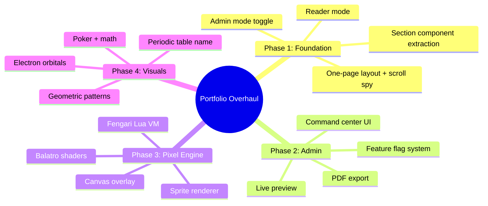

# One-Page Portfolio + Reader Mode + Pixel Engine + Science Visuals

**Date:** 2026-03-29
**Status:** Approved
**Branch:** `feat/theme-overhaul` (current)

## Context

The portfolio currently has 14+ routes each serving distinct content (works, talks, cv, terminal, academia, blog, etc.). The goal is to transform this into a **single-page scrolling experience** with admin-switchable modes, a **Firefox-style reader mode**, a **Lua-scripted pixel art engine** with Balatro-style shaders, and **science/math-themed visual elements** — all controllable from a centralized admin dashboard.

This is driven by the desire to showcase interdisciplinary interests (physics, math, poker, category theory, geometry) through interactive, visually rich pixel art and animations while maintaining a clean reading experience as an alternative.



---

## Phase 1: One-Page Portfolio + Reader Mode

### 1.1 Section Component Extraction

**Goal:** Extract content from each route's `+page.svelte` into reusable `*Section.svelte` components.

**Files created:**
```
src/lib/sections/
├── HeroSection.svelte          ← from src/routes/+page.svelte
├── WorksSection.svelte         ← from src/routes/works/+page.svelte
├── TalksSection.svelte         ← from src/routes/talks/+page.svelte
├── CvSection.svelte            ← from src/routes/cv/+page.svelte
├── TerminalSection.svelte      ← from src/routes/terminal/+page.svelte
├── AcademiaSection.svelte      ← from src/routes/academia/+page.svelte
├── BlogSection.svelte          ← from src/routes/blog/+page.svelte (recent posts summary)
├── ProcessSection.svelte       ← from src/routes/process/+page.svelte
├── GallerySection.svelte       ← from src/routes/gallery/+page.svelte
├── LikesSection.svelte         ← from src/routes/likes/+page.svelte
├── MinorSection.svelte         ← from src/routes/minor/+page.svelte
├── GiftsSection.svelte         ← from src/routes/gifts/+page.svelte
├── OsSection.svelte            ← from src/routes/os/+page.svelte
└── index.ts                    ← re-exports + section metadata (id, label, icon)
```

**Route files become thin wrappers:**
```svelte
<!-- src/routes/works/+page.svelte (after) -->
<script>
  import WorksSection from '$lib/sections/WorksSection.svelte';
</script>
<WorksSection />
```

Each section component accepts an `id` prop for anchor linking and exposes its own data loading (existing `+page.ts` load functions move into the section or use Svelte 5 `$effect` with Convex queries).

### 1.2 One-Page Layout

**New file:** `src/lib/components/OnePageView.svelte`

**Behavior:**
- Renders all section components in sequence, each with `id` for anchor linking
- **Scroll spy:** IntersectionObserver tracks which section is in viewport, highlights active nav item
- **URL sync:** Scrolling to a section updates the URL hash (`/#works`). Visiting `/works` scrolls to `#works`
- **Lazy loading:** Sections render when ~1 viewport away (IntersectionObserver with `rootMargin: '100%'`)
- **Parallax transitions:** Sarah Drasner-style vertical parallax between sections using CSS transforms driven by scroll position. Configurable speed per section (read from Convex `siteConfig`)
- **Keyboard:** `j`/`k` or section number keys to jump between sections
- **Section order:** Read from Convex `siteConfig.sectionOrder` array — admin can reorder

**Mode switching (in `+layout.svelte`):**
- Read `siteConfig.mode` from Convex: `'one-page' | 'multi-page' | 'reader'`
- `one-page`: Root `+page.svelte` renders `<OnePageView />`; individual route pages redirect to `/#section`
- `multi-page`: Normal SvelteKit routing (current behavior)
- `reader`: Root renders `<OnePageView class="reader-mode" />`

### 1.3 Reader Mode

**Implementation:** CSS class `.reader-mode` on the page container + Svelte context flag `readerMode`.

**What reader mode strips:**
- All pixel art, shaders, canvas overlays
- Parallax transitions (sections stack simply)
- ASCII donut, matrix/pipes animations
- Nav chrome (simplified to minimal breadcrumb)
- Footer terminal bar
- iframes / embedded previews
- All decorative animations

**What reader mode keeps:**
- Text content, headings, links
- Clean serif/sans typography (configurable)
- Generous whitespace and line height
- Subtle section dividers
- Static images (optional toggle)

**Toggle mechanisms:**
- Keyboard shortcut: `r` key
- Command palette: "Toggle reader mode"
- Admin: set as default mode for the site
- URL param: `?reader=true`
- Route: configurable from admin (e.g., `/re:mix/home`)

### 1.4 Critical Files Modified
- `src/routes/+layout.svelte` — mode switching logic
- `src/routes/+page.svelte` — conditionally renders OnePageView or HeroSection
- All 14 route `+page.svelte` files — extract content to sections, become wrappers
- `src/app.css` — reader mode styles, parallax utilities, section transition tokens

---

## Phase 2: Admin Command Center

### 2.1 Admin Expansion

**Currently:** `/admin` only controls CV data via Convex + Clerk auth.

**After:** Full site control dashboard with sidebar navigation.

**Admin sections:**
| Section | Controls |
|---------|----------|
| Site Mode | One-page / Multi-page / Reader toggle |
| Section Order | Drag-to-reorder sections, visibility toggles |
| Scroll Transitions | Per-section parallax config, global speed |
| Visual FX | Feature flags for every visual element |
| Pixel Engine | Entity management, shader params, Lua scripts |
| CV | Existing CV CRUD (unchanged) |
| Talks | Existing talks CRUD |
| Works | Existing works CRUD |
| Export | PDF export for CV, JSON export for full site config |

### 2.2 Convex Schema Additions

```typescript
// convex/schema.ts additions

siteConfig: defineTable({
  mode: v.union(v.literal('one-page'), v.literal('multi-page'), v.literal('reader')),
  sectionOrder: v.array(v.string()),  // ['hero', 'works', 'talks', ...]
  parallaxSpeed: v.number(),           // global default 0-1
  readerModeRoute: v.optional(v.string()), // e.g., '/re:mix/home'
}),

featureFlags: defineTable({
  key: v.string(),      // e.g., 'pixel-engine', 'periodic-table-name', 'electron-orbitals'
  enabled: v.boolean(),
  category: v.string(), // 'visual', 'engine', 'science', 'layout'
}),

sectionConfig: defineTable({
  sectionId: v.string(),   // 'hero', 'works', etc.
  visible: v.boolean(),
  parallaxSpeed: v.optional(v.number()),
  transitionType: v.optional(v.string()), // 'none', 'parallax', 'fade', 'portal'
}),
```

### 2.3 PDF Export

CV section export to PDF using client-side `html2canvas` + `jspdf` (no server dependency). Triggered from admin export panel.

### 2.4 Live Preview

Admin embeds an iframe pointing to `/?preview=true` which reads draft config from a separate Convex table (`draftSiteConfig`). Changes are visible in real-time before publishing.

### 2.5 Critical Files Modified
- `src/routes/admin/+page.svelte` — complete overhaul with sidebar + section panels
- `convex/schema.ts` — new tables
- `convex/siteConfig.ts` — new mutations and queries
- `convex/featureFlags.ts` — CRUD for feature flags

---

## Phase 3: Pixel Engine + Lua

### 3.1 Architecture

**New file:** `src/lib/pixel-engine/`
```
src/lib/pixel-engine/
├── PixelCanvas.svelte     ← Fixed-position canvas overlay component
├── engine.ts              ← Main loop: RAF, entity update, render
├── sprites.ts             ← Sprite sheet loader + frame stepper
├── entities.ts            ← Entity registry, spawn/despawn, lifecycle
├── lua-runtime.ts         ← Fengari integration, script loading
├── shaders/
│   ├── crt.glsl           ← CRT scanline shader
│   ├── holographic.glsl   ← Holographic shimmer
│   ├── chromatic.glsl     ← Chromatic aberration
│   └── bloom.glsl         ← Screen glow / bloom
├── shader-pipeline.ts     ← WebGL post-processing compositor
└── scripts/               ← Lua entity behavior scripts
    ├── electron.lua        ← Orbiting electron behavior
    ├── atom.lua            ← Atom with electron shells
    ├── card.lua            ← Poker card with holographic hover
    ├── wanderer.lua        ← Generic wandering creature
    └── portal.lua          ← Rick & Morty portal effect
```

### 3.2 Canvas Overlay

`PixelCanvas.svelte` renders a `<canvas>` with:
- `position: fixed; inset: 0; pointer-events: none; z-index: 100`
- Transparent background — creatures float over page content
- Two-canvas approach: Canvas 2D for sprites → WebGL for post-processing shaders
- Disabled entirely when `readerMode` context is true or `pixel-engine` feature flag is off

### 3.3 Fengari Lua VM

- **Package:** `fengari-web` (~150KB gzipped)
- Each entity type has a `.lua` script defining `update(dt)`, `render()`, `on_click()`, `on_scroll(velocity)`
- Lua scripts access a sandboxed API: `self.x`, `self.y`, `self.sprite`, `mouse_near()`, `section_visible()`, `scroll_pos()`
- Scripts are loaded from `src/lib/pixel-engine/scripts/` at build time (imported as raw strings)
- Admin could eventually edit scripts inline (future stretch goal)

### 3.4 Balatro Shader Pipeline

WebGL fragment shaders applied as post-processing over the sprite canvas:
- **CRT scanlines:** Horizontal line overlay with slight darkening, subtle curvature distortion
- **Holographic shimmer:** Rainbow gradient that shifts with mouse position (on hover over entity)
- **Chromatic aberration:** RGB channel offset (subtle, 1-2px)
- **Bloom:** Bright pixels glow outward

Shader parameters configurable from admin via `visualSettings` Convex table.

### 3.5 Entity System

```typescript
interface Entity {
  id: string;
  type: string;           // 'electron', 'card', 'wanderer', etc.
  x: number; y: number;
  section: string;        // bound to a section id
  sprite: SpriteSheet;
  luaState: LuaState;     // per-entity Lua coroutine
  visible: boolean;       // culled when section off-screen
}
```

- Entities spawn per-section based on admin config
- Update loop: 30fps, calls each entity's Lua `update(dt)`
- Render loop: draw sprites, then apply shader pipeline
- Scroll reactivity: entities receive scroll velocity, can scatter/follow

### 3.6 Performance Budget
- 30fps cap (matches existing ASCII donut)
- Max ~50 entities on screen at once
- Off-screen entities fully culled (no update, no render)
- Entire layer is a single `requestAnimationFrame` loop
- Lazy-load Fengari only when pixel engine is enabled

### 3.7 Critical Files Created
- `src/lib/pixel-engine/` — entire new directory
- `src/lib/components/PixelCanvas.svelte` — overlay component mounted in layout

---

## Phase 4: Science & Math Visuals

### 4.1 Periodic Table Name

**Location:** Hero section, replaces or augments the current name display.

Renders "ZACH TEED" using periodic-table-styled element cards:
- **Zr** (Zirconium, 40) + **C** (Carbon, 6) for "ZC" → creative liberty for "ZACH"
- **Te** (Tellurium, 52) for "TE" → creative liberty for "TEED"
- Non-element letters styled as "undiscovered element" cards
- SVG + CSS implementation, holographic shimmer on hover (shared shader)
- Each card shows: atomic number, symbol, element name

### 4.2 Electron Orbital Animations

- Canvas-drawn Bohr model atoms as background decoration
- Electrons orbit section headers on elliptical paths
- Lua-scripted: orbit speed varies, electrons scatter when mouse approaches
- Tied to pixel engine — rendered on the same canvas overlay

### 4.3 Poker Hand Probability

- Small decorative poker hand displays near works/process sections
- Cards rendered with Balatro holographic foil effect
- Shows probability calculations as subtle overlay text
- Pixel art card sprites (32×32) with shader effects

### 4.4 Category Theory Diagrams

- SVG commutative diagrams as background decoration in academia section
- Animated morphism arrows (draw-on-scroll)
- Objects connected by composition paths
- Minimal, monochrome — doesn't compete with content

### 4.5 Geometric Patterns

Per-section SVG backgrounds:
- **Hero:** Penrose tiling (aperiodic, mathematical beauty)
- **Works:** Voronoi tessellation (generative, tech-art)
- **Academia:** Hyperbolic geometry patterns
- **Terminal:** Grid/matrix patterns (existing vibe)
- Subtle, low-opacity, animated on scroll

### 4.6 Critical Files Created
- `src/lib/sections/PeriodicName.svelte` — periodic table name component
- `src/lib/pixel-engine/scripts/electron.lua`, `atom.lua`, `card.lua` — entity scripts
- `src/lib/components/GeometricBackground.svelte` — per-section pattern renderer
- `src/lib/components/CategoryDiagram.svelte` — SVG diagram component

---

## Implementation Agents

During implementation, run two agents serially after each phase:

1. **Validator Agent:** "Validate whole diff — is everything implemented well, concisely, and safely? Double-check no unwanted disruption to existing functionality."
2. **Minifier Agent:** "Is all this code necessary? Can we reuse more? Use shorter code? Leverage existing utils/packages? Reuse patterns from elsewhere in the codebase?"

Loop both agents until both return "All clean."

---

## Verification Plan

### Phase 1
- [ ] `npm run build` succeeds
- [ ] One-page mode: all 14 sections render on single scroll
- [ ] Multi-page mode: all existing routes work unchanged
- [ ] Reader mode: strips all visual elements, clean typography
- [ ] Scroll spy highlights correct nav item
- [ ] Deep links work: `/works` → scrolls to `#works` in one-page mode
- [ ] Keyboard navigation (j/k) jumps sections
- [ ] Parallax transitions animate smoothly
- [ ] Visual regression: screenshot comparison against current site

### Phase 2
- [ ] Admin sidebar navigates between all sections
- [ ] Mode toggle switches between one-page/multi-page/reader
- [ ] Section reorder persists to Convex and reflects on site
- [ ] Feature flags toggle visual elements on/off
- [ ] PDF export generates readable CV document
- [ ] Live preview iframe reflects config changes in real-time

### Phase 3
- [ ] Canvas overlay renders without blocking page interaction
- [ ] Lua scripts execute in Fengari without errors
- [ ] Sprites animate with correct frame stepping
- [ ] Balatro shaders apply (CRT, holographic, chromatic, bloom)
- [ ] Entities respond to scroll and mouse
- [ ] Reader mode fully disables pixel engine
- [ ] Performance: steady 30fps with 50 entities
- [ ] Feature flag toggles pixel engine on/off from admin

### Phase 4
- [ ] Periodic table name renders correctly with element styling
- [ ] Electron orbitals animate around section headers
- [ ] Poker cards display with holographic effect
- [ ] Category theory diagrams animate on scroll
- [ ] Geometric patterns render as section backgrounds
- [ ] All elements respect feature flags from admin
- [ ] All elements hidden in reader mode

### Cross-Phase
- [ ] No regressions on existing pages (terminal, blog, etc.)
- [ ] Lighthouse performance score > 80 in one-page mode
- [ ] All 4 existing themes still work
- [ ] Mobile responsive: one-page layout works on 375px viewport
- [ ] Accessibility: reader mode passes WCAG AA
