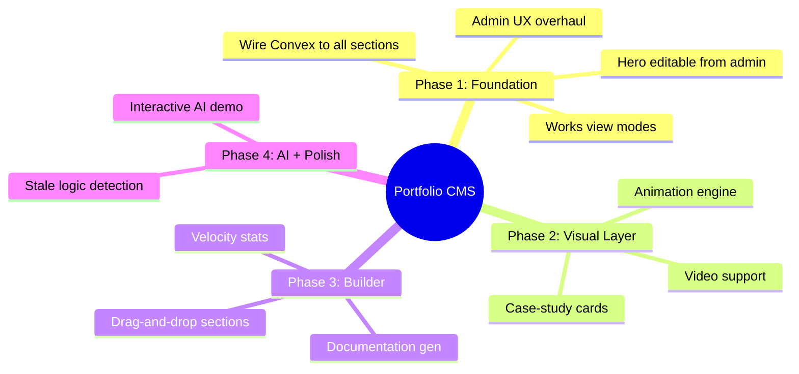

# Portfolio CMS + Visual Control System

**Date:** 2026-03-31
**Status:** Draft → Approved
**Author:** Stüssy Senik + Claude

## Context

The portfolio (`portfolio-forever`) has been built over 12 weeks (Jan 5 → Mar 31, 2026). It has a mature Convex backend (14 tables), admin panel, 4 themes, 317 Playwright tests, and 17 routes. But there's a critical disconnect: **the hero and most sections read from static `content.ts` while admin edits go to Convex and are never seen by visitors.** The admin exists but lacks utilitarian state fidelity — toggles don't reliably persist, navigation is flat, and there's no live preview of changes.

The goal: turn the admin into a **full visual control system** (Webflow/Framer energy) where every piece of text, every display mode, every animation layer is admin-controlled via Convex with real-time updates. The site becomes a live portfolio that the owner has absolute granular control over.

## Diagram



---

## Phase 1: Foundation — Full Headless CMS + Admin UX

### 1a. Convex Schema Extensions

**Extend `cvProfile`** — add hero-specific fields:

```typescript
// convex/schema.ts — cvProfile table
cvProfile: defineTable({
  // existing
  name: v.string(),
  jobTitle: v.string(),
  summary: v.string(),
  url: v.string(),
  sameAs: v.array(v.string()),
  knowsAbout: v.array(v.object({ name: v.string(), proficiency: v.number() })),
  // NEW fields for hero
  taglines: v.optional(v.array(v.object({ lang: v.string(), text: v.string() }))),
  shortBio: v.optional(v.string()),
  location: v.optional(v.string()),
  available: v.optional(v.boolean()),
  email: v.optional(v.string()),
  edition: v.optional(v.string()),
  createdDate: v.optional(v.string()),
})
```

**New `displayConfig` table** — per-section display settings:

```typescript
displayConfig: defineTable({
  section: v.string(),               // 'works' | 'talks' | 'cv' | 'hero' | ...
  viewMode: v.string(),              // 'grid' | 'case-study' | 'minimal-list' | 'pixel-universe'
  animationBg: v.optional(v.string()), // 'none' | 'conway' | 'kanagawa' | 'balatro'
  animationSpeed: v.optional(v.number()),
  animationOpacity: v.optional(v.number()),
  customCSS: v.optional(v.string()), // per-section style overrides
}).index("by_section", ["section"])
```

**New `heroConfig` table** — hero display settings:

```typescript
heroConfig: defineTable({
  showVelocity: v.optional(v.boolean()),
  showAsciiDonut: v.optional(v.boolean()),
  showPixelArt: v.optional(v.boolean()),
  layout: v.optional(v.string()),     // 'default' | 'centered' | 'split'
  accentColor: v.optional(v.string()),
})
```

### 1b. Kill Static Imports — Wire Convex to ALL Content Pages

**Full route migration map:**

| Route | Current Source | Action | New Source |
|-------|---------------|--------|-----------|
| `/` (Home/Hero) | `content.ts` static | **Migrate** | Convex `cvProfile` + `heroConfig` |
| `/works` | Static fallback + Convex | **Remove fallback** | Convex `worksEntries` only |
| `/cv` | Static fallback + Convex | **Remove fallback** | Convex `cv` queries only |
| `/blog` | Sanity CMS | **Migrate CMS** | Convex `blogPosts` (new table) |
| `/talks` | Static fallback + Convex | **Remove fallback** | Convex `talksEntries` only |
| `/likes` | Static fallback + Convex | **Remove fallback** | Convex `likesCategories` only |
| `/gifts` | Hardcoded + Convex | **Remove hardcoded** | Convex `giftsConfig` only |
| `/academia` | Convex | **No change** | Already fully Convex |
| `/gallery` | `content.ts` static | **Migrate** | Convex `galleryItems` (new table) |
| `/minor` | Embedded static arrays | **Migrate** | Convex `minorEntries` (new table) |
| `/labs` | `labs.ts` static | **Migrate** | Convex `labEntries` (new table) |
| `/process` | Embedded SVG | **No change** | Static (intentionally) |
| `/terminal` | `content.ts` profile | **Wire profile** | Convex `cvProfile` for name |
| `/os` | Client ephemeral | **No change** | Ephemeral (intentionally) |
| `/scratchpad` | localStorage | **Optional sync** | localStorage + optional Convex |

**New Convex tables needed:**

```typescript
// Gallery items
galleryItems: defineTable({
  title: v.string(),
  thumbnailUrl: v.optional(v.string()),
  fullUrl: v.optional(v.string()),
  category: v.optional(v.string()),
  year: v.optional(v.number()),
  description: v.optional(v.string()),
  muxPlaybackId: v.optional(v.string()),
  order: v.number(),
  visible: v.boolean(),
}).index("by_order", ["order"])

// Minor things lists
minorEntries: defineTable({
  category: v.string(),       // "lost" | "broken" | "learned" | ...
  text: v.string(),
  year: v.optional(v.number()),
  note: v.optional(v.string()),
  order: v.number(),
  visible: v.boolean(),
}).index("by_category", ["category"]).index("by_order", ["order"])

// Lab experiments
labEntries: defineTable({
  title: v.string(),
  description: v.optional(v.string()),
  status: v.string(),          // "active" | "archived" | "planned"
  date: v.optional(v.string()),
  sourceUrl: v.optional(v.string()),
  tags: v.optional(v.array(v.string())),
  memoryBudget: v.optional(v.string()),
  requiredFeatures: v.optional(v.array(v.string())),
  order: v.number(),
  visible: v.boolean(),
}).index("by_order", ["order"])

// Blog posts (migrated from Sanity)
blogPosts: defineTable({
  title: v.string(),
  slug: v.string(),
  content: v.string(),         // markdown or portable text
  excerpt: v.optional(v.string()),
  tags: v.optional(v.array(v.string())),
  publishedAt: v.optional(v.string()),
  coverImage: v.optional(v.string()),
  visible: v.boolean(),
}).index("by_slug", ["slug"]).index("by_published", ["publishedAt"])
```

**Pattern — Svelte Convex subscription:**

```svelte
<script>
  import { useQuery } from '$lib/convex';
  import { api } from '$convex/_generated/api';

  const profile = useQuery(api.cv.getVisibleCV);
  const displayConfig = useQuery(api.display.getConfig, { section: 'hero' });
</script>
```

**Seed migration** — `content.ts` data → Convex seed script:
- Create `convex/seedProfile.ts` that reads current `content.ts` values and populates `cvProfile` with all new fields
- Run once, then `content.ts` becomes reference-only

### 1c. Admin UX Overhaul

**Navigation restructure** — three groups:

```
┌──────────────────────────────────────────────────┐
│ Appearance    │ Content          │ System         │
│───────────────│──────────────────│────────────────│
│ Theme         │ Hero/Profile     │ Feature Flags  │
│ Font          │ Works            │ Display Modes  │
│ Animation     │ CV               │ Velocity Stats │
│ Layout        │ Talks            │ Export/Import  │
│               │ Likes            │ Health Check   │
│               │ Gifts            │                │
│               │ Academia         │                │
│               │ Gallery          │                │
│               │ Minor            │                │
│               │ Labs             │                │
│               │ Blog             │                │
└──────────────────────────────────────────────────┘
```

**State fidelity requirements:**
- Every mutation shows inline `✓ saved` confirmation (fade after 2s)
- Convex real-time subscriptions = admin always reflects true DB state
- No stale UI — if another tab changes data, admin updates instantly
- Toast on error with retry action

**ProfileAdmin expansion** — new fields:
- `taglines` (array editor — lang + text pairs)
- `shortBio` (textarea)
- `location` (text input)
- `available` (boolean toggle)
- `email` (text input)

### 1d. Works View Modes

**Four modes, admin-selectable per section:**

1. **`grid`** (current default) — responsive card grid with iframe previews
2. **`case-study`** (Addy Osmani style) — dark bg, gold accents, impact metrics, tech stack badges, hero image. Professional authority.
3. **`minimal-list`** — dense text list: title, one-liner, tech stack, year. CTO-scannable in 10 seconds.
4. **`pixel-universe`** — projects rendered as pixel objects in animation canvas. Click to enter. Uses existing Lua pixel engine.

**Admin control surface:**

```
Display Mode: [ Grid ▾ ]     ← per-section dropdown
Animation BG: [ None ▾ ]     ← optional background layer
Anim Speed:   [====○===]     ← slider
Anim Opacity: [======○=]     ← slider
```

**Per-item overrides** — extend `worksEntries`:
```typescript
// Add to worksEntries schema
styleOverrides: v.optional(v.object({
  accentColor: v.optional(v.string()),
  badgeStyle: v.optional(v.string()),
  impactMetrics: v.optional(v.array(v.object({
    label: v.string(),
    value: v.string(),
  }))),
}))
```

---

## Phase 2: Visual Layer — Animation Engine + Case Study Cards

### 2a. Case-Study Card Component

**Design spec (Addy Osmani inspired):**
- Dark background (`#0A0A0A`)
- Accent colors: gold `#FEED73`, blue `#4361b3`, or per-project `featured` color
- Layout: hero image/video top, title + tech badges middle, impact metrics bottom
- Responsive: single column mobile, 2-col tablet, 3-col desktop
- Hover: subtle scale + shadow elevation
- Impact metrics: admin-editable (e.g., "40% faster", "10k users", "3 awards")

### 2b. Animation Engine Expansion

**Architecture:**
```
AnimationCanvas.svelte
├── ConwayEngine.ts        (Game of Life — Lua via Fengari)
├── KanagawaEngine.ts      (Japanese wave — WebGL shader)
├── BalatraEngine.ts       (existing shader pipeline)
└── AnimationManager.ts    (admin config → engine selection)
```

**Conway's Game of Life:**
- Grid-based cellular automaton
- Lua implementation via existing Fengari VM
- Admin controls: grid size, speed, color scheme, initial pattern
- Can run as full-screen mode OR subtle background

**Kanagawa Wave:**
- WebGL fragment shader (canvas-based)
- Sine wave composition with noise
- Admin controls: wave count, amplitude, speed, color palette
- Inspired by Hokusai's The Great Wave — stylized, not literal

**All animations:**
- Dual mode: `background` (subtle, behind content) or `full` (Pixel Universe mode)
- Respect `prefers-reduced-motion`
- Lazy-loaded, GPU-accelerated
- Admin toggle: on/off per section + global

### 2c. Video Support

- `MuxVideo.svelte` already exists — wire into works grid/case-study views
- Admin: paste Mux playback ID per project (field exists in schema)
- Grid mode: auto-play on hover, muted
- Case-study mode: inline player with controls
- Pixel Universe: video texture mapped onto pixel object (stretch goal)

---

## Phase 3: Builder Experience — Sections + Velocity

### 3a. Enhanced Section Builder

- `SectionOrderAdmin` already exists — enhance with:
  - Drag handle visual feedback
  - Per-section display mode dropdown (inline)
  - Per-section visibility toggle (inline)
  - Per-section animation background picker (inline)
- Sections become fully composable: reorder, restyle, show/hide

### 3b. Developer Velocity Stats

**Computation:**
- Git history analysis: `git log --format="%ai" --all` → commits/week, active days, LOC delta
- Project age: first commit date → now
- Convex stores computed stats (updated via action or manual trigger)

**New `velocityStats` table:**
```typescript
velocityStats: defineTable({
  projectAge: v.string(),      // "12 weeks"
  totalCommits: v.number(),
  totalLOC: v.number(),
  commitsPerWeek: v.number(),
  activeDays: v.number(),
  lastComputed: v.string(),    // ISO date
})
```

**Hero badge (admin-toggleable):**
```
12 weeks · 87 commits · 4.7k LOC
```

### 3c. Documentation Generation

- `README.md` — auto-generated from Convex data (profile, works, tech stack)
- `ROADMAP.md` — phases from this spec, updated as phases complete
- `PROGRESS.md` — velocity stats + session notes

---

## Phase 4: AI Demo + Self-Discovery

### 4a. Interactive AI Demo (Vercel v0 / Linear inspired)

- Embedded AI experience — native to the site, not a widget
- Powered by NVIDIA NIM or GLM API (user provides key)
- Understands portfolio data via Convex context injection
- Visitor interaction: explore work, ask questions, see live demonstrations
- **Key differentiator:** AI can trigger animations, switch view modes, highlight projects — it controls the portfolio UI as a response to queries

### 4b. Stale Logic Self-Discovery

- Programmatic scan: find `content.ts` imports that should be Convex subscriptions
- Detect unused Convex fields (schema vs actual writes)
- Admin "Health" tab: sync status across all sections
- Lint rule: flag direct `content.ts` imports in section components

---

## Critical Files

### Convex Backend
| File | Action |
|------|--------|
| `convex/schema.ts` | Extend cvProfile, add displayConfig, heroConfig, velocityStats, galleryItems, minorEntries, labEntries, blogPosts |
| `convex/cv.ts` | Extend updateProfile mutation with new fields |
| `convex/display.ts` | **NEW** — displayConfig CRUD per section |
| `convex/hero.ts` | **NEW** — heroConfig CRUD |
| `convex/gallery.ts` | **NEW** — gallery items CRUD |
| `convex/minor.ts` | **NEW** — minor entries CRUD |
| `convex/labs.ts` | **NEW** — lab entries CRUD |
| `convex/blog.ts` | **NEW** — blog posts CRUD (replaces Sanity) |
| `convex/velocity.ts` | **NEW** — velocity stats action |
| `convex/seed.ts` | Extend to seed ALL content from content.ts + labs.ts |

### Frontend Sections (wire to Convex)
| File | Action |
|------|--------|
| `src/lib/sections/HeroSection.svelte` | Replace content.ts with Convex subscription |
| `src/lib/sections/WorksSection.svelte` | Add view mode rendering, remove static fallback |
| `src/routes/gallery/+page.svelte` | Replace content.ts with Convex subscription |
| `src/routes/minor/+page.svelte` | Replace embedded arrays with Convex subscription |
| `src/routes/labs/+page.svelte` | Replace labs.ts with Convex subscription |
| `src/routes/blog/+page.svelte` | Replace Sanity with Convex subscription |
| `src/routes/works/+page.svelte` | Remove static fallback array |
| `src/routes/cv/+page.svelte` | Remove static fallback |
| `src/routes/talks/+page.svelte` | Remove static fallback |
| `src/routes/likes/+page.svelte` | Remove static fallback |
| `src/routes/gifts/+page.svelte` | Remove hardcoded defaults |
| `src/routes/terminal/+page.svelte` | Wire profile name from Convex |

### Admin Components
| File | Action |
|------|--------|
| `src/routes/admin/+page.svelte` | Restructure with grouped navigation (Appearance/Content/System) |
| `src/lib/admin/index.ts` | Add new admin component exports |
| `src/lib/admin/ProfileAdmin.svelte` | Add taglines, shortBio, location, email fields |
| `src/lib/admin/DisplayAdmin.svelte` | **NEW** — view mode + animation controls per section |
| `src/lib/admin/HeroAdmin.svelte` | **NEW** — hero display settings |
| `src/lib/admin/GalleryAdmin.svelte` | **NEW** — gallery items CRUD |
| `src/lib/admin/MinorAdmin.svelte` | **NEW** — minor things CRUD |
| `src/lib/admin/LabsAdmin.svelte` | **NEW** — lab experiments CRUD |
| `src/lib/admin/BlogAdmin.svelte` | **NEW** — blog posts CRUD |
| `src/lib/admin/VelocityAdmin.svelte` | **NEW** — velocity stats toggle + compute |

### Visual Components
| File | Action |
|------|--------|
| `src/lib/components/CaseStudyCard.svelte` | **NEW** — Addy Osmani style card |
| `src/lib/components/AnimationCanvas.svelte` | **NEW** — animation engine wrapper |
| `src/lib/pixel-engine/conway.lua` | **NEW** — Game of Life implementation |
| `src/lib/pixel-engine/kanagawa.glsl` | **NEW** — wave shader |
| `src/app.css` | Case-study theme tokens, animation variables |

## Existing Utilities to Reuse

- `src/lib/admin/EditableField.svelte` — inline text editing (reuse for all new admin fields)
- `src/lib/admin/ReorderableList.svelte` — drag-and-drop (reuse for section builder)
- `src/lib/admin/VisibilityToggle.svelte` — boolean toggles (reuse for all new toggles)
- `src/lib/admin/ListEditor.svelte` — array editing (reuse for taglines, impact metrics)
- `src/lib/components/PixelCanvas.svelte` — existing pixel engine (extend for Conway's/Kanagawa)
- `src/lib/components/MuxVideo.svelte` — video player (wire into view modes)
- `convex/helpers.ts` → `stripUndefined()` — use in all new mutations
- `src/lib/stores/` — toast store for save confirmations

## Verification Plan

### Phase 1 verification:
1. **Seed test:** Run seed script → verify all content.ts data in Convex dashboard
2. **Hero test:** Edit name in /admin → verify hero updates in real-time on /
3. **State fidelity:** Toggle visibility on 5 items rapidly → verify all persist correctly
4. **View mode test:** Switch works to each mode → verify same data renders differently
5. **Existing tests:** All 317 Playwright tests still pass (sections now read Convex, same rendered output)

### Phase 2 verification:
6. **Case-study render:** Works in case-study mode with impact metrics, tech badges, video
7. **Animation test:** Each algorithm runs at 60fps, respects reduced-motion, admin-controllable
8. **Background layer:** Animation behind standard grid, opacity/speed adjustable

### Phase 3 verification:
9. **Drag-and-drop:** Reorder sections → verify persist + render order matches
10. **Velocity:** Computed stats match `git log` output
11. **Docs:** Generated README contains current profile + works from Convex

### Phase 4 verification:
12. **AI demo:** Visitor asks about a project → AI responds with correct data + triggers UI action
13. **Health check:** Stale logic scanner finds zero content.ts imports in sections

## Implementation Workflow

During implementation, run two serial iteration agents after each major change:

1. **Validator agent:** "Validate whole diff — is everything implemented correctly, concisely, safely? No disruption to existing functionality?"
2. **Minifier agent:** "Is there smarter reuse? Shorter code? Available utils or packages? Patterns from elsewhere in the codebase?"

Iterate until both return "All clean."
