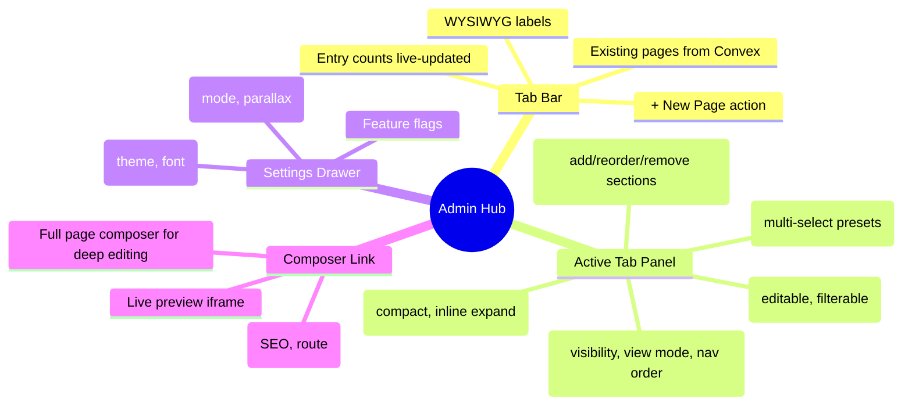

# Admin Content Hub — Tabbed Page Manager with Composable Sections

## Context

The admin dashboard currently has two disconnected modes:
1. **PageGrid** — creates new pages, shows them as abstract cards with entry counts
2. **[pageId] Composer** — edits a single page's sections, preview iframe, meta panel

The problem: landing on /admin doesn't let you immediately manage existing pages (Works, Blog, CV, re:mix, Terminal, Process, Likes, Gifts, Gallery, OS, Labs, Minor). You see cards, not content. There's no way to quickly edit entries, toggle visibility, change colors, or compose sections without navigating into a separate view.

**Goal:** Unify existing page management and new page creation into a single Linear-style admin hub. Every page is one click away. Entry data, color strips, animation presets, and section composition are all accessible from the landing page. What you see is what's saved.

## Design Decisions

### 1. Tab Bar — Page Navigator

A horizontal scrollable tab bar showing all pages from the Convex `pages` table + `sectionRegistry`, ordered by `navOrder`.

**Rules:**
- Tab labels are **WYSIWYG** — the string displayed comes directly from `page.label` in Convex with zero transformation. No `toUpperCase()`, no `capitalize()`, no template literals. The raw stored string renders.
- Validation: on save, labels are trimmed and checked for emptiness. No other normalization. If the user types `re:mix`, that's what's stored and displayed everywhere (tabs, nav, page title).
- Active tab has a `border-bottom: 2px solid var(--bento-blue)` indicator.
- Each tab shows entry count (from the page's `dataTable` query) as a small green/muted number.
- Final tab position: `+ New Page` button — opens the existing page creation flow (PageGrid/upsert).
- Keyboard: `ArrowLeft`/`ArrowRight` to switch tabs. `1-9` for quick jump to first 9 tabs.

**Data source:** `api.pages.getAll()` is the primary source. For sections that exist in `sectionRegistry` but don't have a corresponding page yet, auto-create a page document via `api.pages.seedFromRegistry()` on admin load (this mutation already exists and is idempotent). After seeding, `pages` is the single source of truth — no dual-read merge at render time. Entry counts come from each section's data table query (e.g., `api.works.getAll()`, `api.blog.getFullPosts()`), keyed by the `dataTable` field in `sectionTypeRegistry`.

### 2. Active Tab Panel — Page Content

When a tab is selected, the panel below shows that page's content in a consistent layout:

#### 2a. Page Controls Row

Horizontal chip bar below the page title:

| Control | Behavior | Persists to |
|---------|----------|-------------|
| View mode | Dropdown: grid, case-study, minimal-list, pixel-universe | `sectionRegistry.viewMode` or `page.sections[].config.viewMode` |
| Visibility | Toggle button: `visible` (green text) / `hidden` (muted text) | `page.visible` + `sectionRegistry.visible` |
| Nav visibility | Toggle: `in nav` / `not in nav` | `page.navVisible` |
| Nav order | Stepper or inline edit: `nav: 3rd` | `page.navOrder` |

All controls save to Convex immediately on interaction. No save button needed.

#### 2b. Color Strip

For pages with data tables that have a `featured` or `accentColor` field (Works, Talks, Gallery, etc.):

- Row of color swatches from the named palette (`orange`, `green`, `electric-green`, `ocean`, `gold`, `pink`, `cloud`, `red`, `yellow`).
- Each swatch shows a count of entries assigned that color.
- **Click a swatch** → filters the entry list to that color only.
- **Click an entry's color dot** → opens a small palette popover to reassign the entry's color. Saves immediately.
- Pages without color-able entries (Terminal, Process, OS, Gifts) don't show the strip.

#### 2c. Composable Particle Animations

A control row for the Lua pixel engine, replacing the old AnimationsCell:

- **Toggle switch**: on/off for the pixel engine on this page/section.
- **Multi-select preset chips**: `electrons`, `wanderers`, `cards` — each is independently toggleable. You compose your particle mix by adding presets, not picking one.
- Active presets are highlighted (green border + text). Inactive are muted.
- Persists to: `page.sections[].config.particles` as a string array (e.g., `["electrons", "cards"]`). The global pixel-engine feature flag controls whether the renderer is loaded at all. Per-page particle config controls which presets run. If the feature flag is off, particle controls are visible but show a "pixel engine disabled globally" hint with a link to Settings > Flags.

#### 2d. Entry Table

Compact, Linear-style table for pages with data entries:

| Column | Content |
|--------|---------|
| Color dot | Circle showing the entry's `featured` color (clickable to change) |
| Title | Entry title — the exact string from Convex |
| Category/Type | Entry category, type, or tags |
| Date | Year or full date depending on content type |
| Actions | `edit` (text button, blue) · `visible`/`hidden` (text toggle, green/muted) |

**Edit interaction:** Clicking `edit` expands the row inline to show all editable fields for that entry type. Fields vary by data table (Works shows URL, viewport, camera; Blog shows slug, excerpt, content, tags; CV shows type, org, dates, description). Save on blur or Enter. Cancel on Escape.

**Reorder:** `Cmd+ArrowUp` / `Cmd+ArrowDown` to reorder the selected entry. Visual feedback: row slides with a brief animation.

**Add:** `+ Add entry` button at bottom, or `Cmd+N`. Creates a new entry with defaults, immediately opens it in edit mode.

**Delete:** Available inside the expanded edit row. Requires confirmation (click delete, text changes to "confirm?", click again to delete).

#### 2e. Section Composer

Below the entry table, a section management area for composing the page's section layout:

- Shows the current `page.sections[]` array as a reorderable list.
- Each section shows: type label, data source indicator, drag handle.
- **Add section** button opens the existing `SectionPicker` component.
- **Remove section** button on each item (with confirmation).
- **Reorder** via drag or arrow buttons.
- Links to the full `[pageId]` composer for deep editing (meta, preview iframe, per-section config).

This is where the existing page system and the new page system **intersect** — every page, whether pre-existing (Works, Blog) or newly created, can have sections added/removed/reordered through the same interface.

### 3. Page Types

Pages fall into two categories with different tab panel contents:

#### Data-driven pages (have entries)
Works, Blog, CV, re:mix, Talks, Likes, Gallery, Labs, Minor, Gifts

Panel shows: controls + color strip (if applicable) + particles + entry table + section composer.

#### Component-only pages (no data table)
Terminal, Process, OS

Panel shows: controls + particles + section composer + component-specific toggles (e.g., Terminal's matrix/pipes animation mode, Process's SVG variant).

### 4. Settings Drawer

The existing SettingsDrawer stays as-is, accessible from the top bar "Settings" button. Contains:
- AppearanceCell (theme/font)
- ConfigCell (site mode, parallax)
- FlagsCell (feature flags)

These are global settings, not per-page. The tab panel handles per-page controls.

### 5. New Page Creation

The `+ New Page` tab action:
1. Opens a minimal form: label (WYSIWYG — what you type is what's stored), route, initial section type.
2. Creates the page via `api.pages.upsert()`.
3. New page appears as a new tab immediately (Convex subscription).
4. Tab auto-selects to the new page.
5. User can immediately start adding sections and entries.

This replaces the PageGrid as the primary page creation flow while preserving all the existing mutation logic.

### 6. String Validation & WYSIWYG Contract

**Core rule:** Display string === Stored string. No transformation layer.

- `page.label` is displayed as-is in tabs, headings, nav.
- `page.route` is displayed as-is (must start with `/`).
- `page.navLabel` falls back to `page.label` if not set.
- Entry fields (title, slug, category, tags) are stored as typed.
- Validation on save:
  - Trim whitespace from both ends.
  - Reject empty strings for required fields.
  - Route must match `/^\/[a-z0-9\-:]*$/` (lowercase, hyphens, colons allowed).
  - No case normalization. No automatic capitalization.
- The same string that appears in the admin tab appears in the site nav, page heading, and URL. Single source of truth.

### 7. Accessibility

- Tab bar uses `role="tablist"` with `role="tab"` children and `aria-selected`.
- Tab panel uses `role="tabpanel"` with `aria-labelledby` pointing to the active tab.
- All interactive controls are `<button>` elements (not `
`).
- Toggle buttons use `aria-pressed="true|false"`.
- Particle presets use multi-select pattern: each is a `<button aria-pressed>`, not a radiogroup.
- Entry table uses `<table>` with `<thead>`/`<tbody>` and proper `<th>` elements.
- Color swatches have `aria-label` with the color name and count.
- Keyboard navigation: Tab moves between controls, Enter/Space activates, Escape closes expanded rows.
- Focus management: when a tab is selected, focus moves to the first control in the panel.

## Files to Modify

### New files
- `src/lib/admin/ContentHub.svelte` — Main tabbed content hub component (replaces PageGrid as landing view)
- `src/lib/admin/PageTab.svelte` — Individual tab component with WYSIWYG label + count
- `src/lib/admin/PagePanel.svelte` — Active tab's content panel (controls, color strip, particles, entries, sections)
- `src/lib/admin/controls/ParticlesCell.svelte` — Composable particle toggle + multi-select presets (replaces radio-style AnimationsCell)
- `src/lib/admin/controls/ColorStrip.svelte` — Editable color distribution strip with palette popover
- `src/lib/admin/EntryTable.svelte` — Generic entry table component that adapts columns to the data table type
- `src/lib/admin/EntryRow.svelte` — Expandable entry row with inline field editing

### Modified files
- `src/routes/admin/+page.svelte` — Replace PageGrid with ContentHub as primary view, keep SettingsDrawer
- `src/lib/admin/controls/AnimationsCell.svelte` — Refactor or replace with ParticlesCell
- `src/lib/admin/index.ts` — Export new components
- `convex/sectionRegistry.ts` — Update `animationBg` field to support comma-separated preset lists
- `src/lib/admin/admin-utils.ts` — Add string validation helpers (trim, route regex, empty check)

### Preserved files (no changes)
- `src/routes/admin/[pageId]/+page.svelte` — Composer stays as deep-edit view
- `src/lib/admin/SectionList.svelte` — Reused in PagePanel's section composer
- `src/lib/admin/SectionPicker.svelte` — Reused for adding sections
- `src/lib/admin/SettingsDrawer.svelte` — Global settings stays as-is
- `src/lib/admin/BlogAdmin.svelte`, `WorksAdmin.svelte`, etc. — Entry managers reused inside EntryTable's expanded rows
- `convex/pages.ts` — No schema changes needed, sections array already supports composition
- `convex/themes.ts` — No changes

## Reusable Existing Code

- **`SectionPicker.svelte`** (`src/lib/admin/SectionPicker.svelte`) — Section type selector with icons/categories. Reuse in PagePanel for adding sections to existing pages.
- **`SectionList.svelte`** (`src/lib/admin/SectionList.svelte`) — Reorderable section list. Embed in PagePanel below entry table.
- **`admin-utils.ts:reorderEntry()`** — Generic reorder mutation. Use for entry reordering in EntryTable.
- **`admin-utils.ts:a11yClick()`** — Keyboard event handler. Use on all interactive elements.
- **`constants.ts:VIEW_MODES`** — View mode options for the dropdown chip.
- **`constants.ts:stripConvexMeta()`** — Strip internal fields before mutations.
- **All existing entry admin components** (BlogAdmin, WorksAdmin, etc.) — Their field layouts and mutation logic can be extracted or composed into EntryRow's expanded state.
- **`api.pages.getAll()`**, **`api.pages.upsert()`**, **`api.pages.updateSections()`** — All page mutations already exist.
- **`api.sectionRegistry.getAll()`**, **`api.sectionRegistry.upsert()`** — Section config mutations exist.
- **`registry.ts:sectionTypeRegistry`** (`src/lib/sections/registry.ts`) — Maps section types to labels, icons, data tables. Use for tab icons and entry table type detection.

## Verification

1. **Visual:** Open /admin. All existing pages appear as tabs with correct WYSIWYG labels and entry counts. Click each tab — panel shows that page's entries, color strip, controls.
2. **WYSIWYG:** Change a page label in the admin. Verify it appears identically in: the tab, the page title, the site nav, and the Convex dashboard.
3. **Color strip:** Click a color swatch on Works tab. Entry list filters. Click an entry's color dot, change color via popover. Verify the new color appears on the live site.
4. **Particles:** Toggle particles on for a section. Multi-select electrons + cards. Verify both entity types appear on the live page. Toggle off — particles disappear.
5. **Visibility:** Toggle a page to `hidden`. Verify it disappears from the public nav. Toggle an entry to `hidden`. Verify it's hidden on the live page.
6. **New page:** Click `+ New Page`. Create "Scratchpad" at `/scratchpad`. Verify new tab appears. Add a section via SectionPicker. Verify the section renders on the live route.
7. **Section composition:** On an existing page (e.g., Works), add a new section (e.g., `text-block`). Reorder it. Remove it. Verify changes persist and render correctly.
8. **Accessibility:** Tab through the entire admin with keyboard only. Verify all controls are reachable, toggles announce state, table is navigable.
9. **Persistence:** Refresh the page. All changes (labels, colors, visibility, particles, sections) persist from Convex subscriptions.
10. **Existing tests:** Run `npx playwright test tests/e2e/admin.spec.ts` — existing admin tests should still pass.
