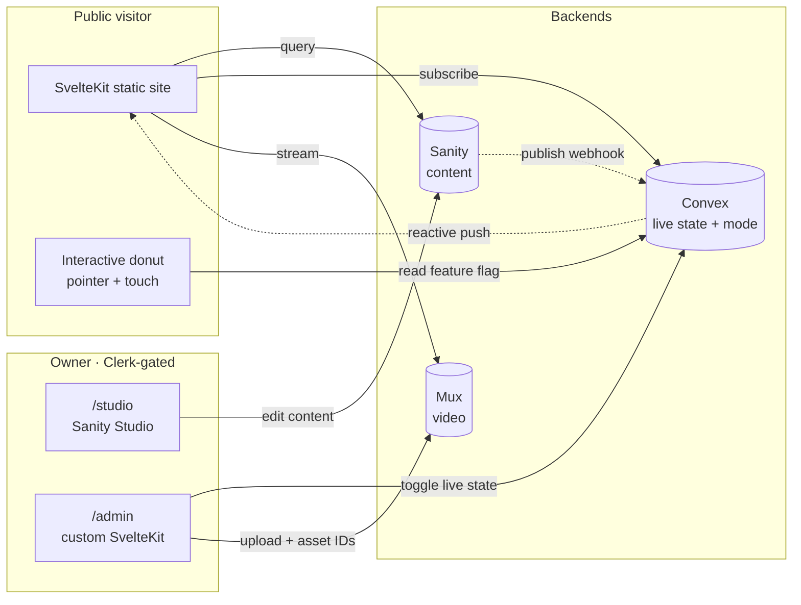

# stussysenik Live Portfolio — Design Spec

**Date:** 2026-04-14
**Status:** Draft, awaiting owner review
**Owner:** senik (stussysenik)
**Related research:** [`docs/superpowers/research/2026-04-14-interactive-portfolio-legends.md`](../research/2026-04-14-interactive-portfolio-legends.md)

---

## Purpose

Transform the existing SvelteKit portfolio at `/Users/senik/Desktop/portfolio-forever` into a **configuration-driven live portfolio** for a photographer/videographer (handle: `stussysenik`). The site must be:

- **Live-editable** via a custom `/admin` panel + Sanity Studio — no redeploys for content or layout changes
- **Schema-first** — every design choice is a typed field on a typed section; the code defines the possibility space, the CMS chooses which variants are live
- **Mobile-first responsive from 360×740 (Samsung S8) upward**
- **Interactive centerpiece** — a draggable ASCII donut with a tier-upgradable render path (`<pre>` → Canvas/Worker → WebGPU+WASM), pointer-following inside a bounded zone
- **Minimal footprint** — 4 runtime dependencies total, <100 KB gzipped JS budget, progressive enhancement at every boundary
- **Open-source from day one** — public repo, env-var-safe, cites its own source in the footer

## Non-goals

- Building our own WebSocket backend (Convex is one)
- Custom CMS editor (Sanity Studio covers content; custom `/admin` covers live state only)
- Generic dev-portfolio layouts (sidebar-nav screams engineer, not photographer)
- Canned animation libraries for "delight" (interaction is procedural, not timeline)
- Multi-runtime polyglot backends (Elixir/Python/Go on Railway) — solved problems stay solved
- **Allowing automated tools (LLMs, scripts, CI) to publish owner-authored content changes.** Automation proposes drafts; the owner disposes. See *Content Sovereignty & Guardrails* below and the canonical [`CONTENT_RULES.md`](../../../CONTENT_RULES.md) at the repo root.

---

## Core Principle 1 — *zero design decisions at architecture time*

The spec defines the **vocabulary**. The owner speaks the **sentences** via the CMS.

- Every visual, layout, and behavior choice is a typed variant enum on a typed section
- The code knows *how to render every variant*
- The CMS decides *which variants are live right now*
- Modes are preset bundles of section configurations, applied with one click, then freely overrideable
- This spec never says "hero is photo" — it says `hero.variant: enum [photo-full-bleed | donut-centerpiece | text-only | ...]`

## Core Principle 2 — *content is sacred, configuration is malleable*

The owner authors every word, image, caption, and copy block in their own voice. Automation (LLMs, scripts, CI) may freely edit *configuration* (variants, layouts, modes, presentation knobs) but must **never silently write to content fields**.

- Every schema field is classified `owner-only` | `llm-assisted` | `system`
- Automation writes to Sanity drafts only — never to published documents
- A **Review Mode** kill switch in `/admin` freezes all content writes globally during sensitive review sessions
- Every content change is logged in a Convex audit table with source, diff, and rollback capability
- The canonical contract lives at [`CONTENT_RULES.md`](../../../CONTENT_RULES.md) in the repo root; every LLM session reads it before acting
- Full architectural treatment in *Content Sovereignty & Guardrails* below

## Guiding Principles (from research)

1. Inevitability over ornament (remove test)
2. One hero move, everything else quiet
3. Input-driven interactions, not timeline-driven
4. Motion signals state change — never ambient wallpaper
5. Austere chrome, rich centerpiece
6. Voice-first copy (no template language)
7. Robustness is the invisible flex (survive adversarial input)
8. First-touch under 400ms
9. One motif, many variations (the donut vocabulary echoes into the gallery)
10. Cite yourself (footer `view-source · donut.ts →`)

---

## System Overview



Three backends, three jobs, zero overlap:
- **Sanity** owns *what it is* — content, copy, photos, videos, Mux asset IDs, blog posts, bios
- **Convex** owns *how it's presented right now* — current mode, feature flags, section order, section visibility, donut render tier, view counters
- **Mux** owns the heavy video pixels
- **URL** owns route state
- **Clerk** gates `/admin` and `/studio`

## Stack

| Layer | Choice | Rationale |
|---|---|---|
| Framework | SvelteKit 2 + Svelte 5 (already installed) | Static adapter, reactive stores, already configured |
| Runtime | Bun | Already the package manager, faster than npm |
| Build | Vite 7 (already installed) | WASM + top-level-await plugins added for donut Tier 2 |
| Content CMS | Sanity (already installed) | Headless, free tier generous, Studio auto-generates editors |
| Live state | Convex (already installed) | Managed reactive WebSocket backend, type-safe |
| Video | Mux via `@mux/mux-player` (already installed) | Industry standard for creator video |
| Auth | Clerk (already installed) | Best DX 2026, protects `/admin` and `/studio` |
| A11y primitives | **melt-ui** (new dependency) | Headless focus traps, dialogs, dropdowns, drag — by Svelte core team |
| Hosting | Vercel (already configured) | Static adapter builds, edge-fast |

**Total runtime dependencies: 4** — SvelteKit, melt-ui, Convex client, Mux player. No motion library. No state library. No animation framework.

---

## Content Sovereignty & Guardrails

This section is the architectural expression of Core Principle 2. The canonical, non-negotiable contract is [`CONTENT_RULES.md`](../../../CONTENT_RULES.md) at the repo root — this spec section describes how we *implement* the rules.

### Field classification

Every field in every Sanity schema and every Convex table carries a `_authorship` classification:

```typescript
type Authorship =
  | 'owner-only'    // words, images, captions, bios, CV entries, blog bodies, asset selections
  | 'llm-assisted'  // variants, layouts, modes, columns, colors, speeds, ordering
  | 'system'        // audit timestamps, counters, build hashes — system-managed only
```

**Default for any new field: `owner-only`.** Defensive default — forces explicit reclassification if a field is actually configuration.

Example Sanity schema annotation:

```typescript
export const heroSchema = defineType({
  name: 'hero',
  type: 'document',
  fields: [
    { name: 'headline',  type: 'string', _authorship: 'owner-only' },
    { name: 'subhead',   type: 'string', _authorship: 'owner-only' },
    { name: 'alignment', type: 'string', _authorship: 'llm-assisted' },
    { name: 'photoRef',  type: 'reference', to: [{ type: 'photo' }], _authorship: 'owner-only' },
  ]
})
```

Example Convex table annotation:

```typescript
// convex/schema.ts
export default defineSchema({
  pageConfig: defineTable({
    mode: v.string(),           // llm-assisted
    sections: v.array(...),     // llm-assisted (variants, order)
    reviewMode: v.boolean(),    // system (flipped from /admin only)
    _authorshipMap: v.any(),    // per-field classification
  })
})
```

### The five guardrails

**1. Classification is load-bearing.** CI fails the build if any Sanity schema or Convex table defines a field without `_authorship`. No unclassified fields in production, ever.

**2. Drafts-only for automation.** Every automated write path (Claude tool calls, scripts, CI jobs, future LLM agents) writes to Sanity **draft** documents. The owner promotes draft → published through Sanity Studio UI or the `/admin` publish button, and only that button has the published-write capability. Any automated mutation attempting to write published state throws a hard error with a loud log entry.

**3. Review Mode — the global kill switch.** A top-level Convex flag `reviewMode: boolean`. When true:
- All writes to `owner-only` fields are rejected from every write path
- Configuration writes (`llm-assisted`) still succeed, so presentation can be tuned without touching content
- A prominent visual banner appears on every `/admin` screen so the owner always knows
- Auto-arm option: can be wired to turn on when a `/review/:token` link is visited, off when the session expires
- Flippable from the `/admin` dashboard in one tap

**4. Audit log.** A Convex table `auditLog` records every mutation:

```typescript
auditLog: defineTable({
  timestamp: v.number(),
  source: v.union(
    v.literal('owner'),
    v.literal('admin-ui'),
    v.literal('studio'),
    v.literal('llm'),
    v.literal('system'),
    v.literal('script'),
  ),
  actor: v.optional(v.string()),         // Clerk userId or tool identifier
  fieldPath: v.string(),                 // e.g., "sections[2].content.headline"
  operation: v.union(v.literal('create'), v.literal('update'), v.literal('delete')),
  oldValue: v.optional(v.any()),
  newValue: v.optional(v.any()),
  reviewModeAtTime: v.boolean(),
  classificationAtTime: v.string(),      // owner-only | llm-assisted | system
})
```

The `/admin` **Audit** screen shows a reverse-chronological feed of entries with a one-click rollback per entry. Rollbacks are themselves audit entries (full history preserved).

**5. LLM boundary contract.** [`CONTENT_RULES.md`](../../../CONTENT_RULES.md) at the repo root is the canonical document. Every LLM tooling file (`CLAUDE.md`, `AGENTS.md`) points to it. Every future Claude session reads it before acting. Summary of obligations for LLMs:

- Read `CONTENT_RULES.md` before making any change
- Never edit `owner-only` fields without per-change owner approval
- Never bypass Review Mode
- Default-classify ambiguous fields as `owner-only` and ask the owner
- State intended changes to content-adjacent files *before* making them

### Implementation impact on other parts of the spec

- **Sanity schemas** gain an `_authorship` field on every definition. Existing schemas (blog posts, images) are classified retroactively — default `owner-only`.
- **Convex schema** gains the `auditLog` table, the `reviewMode` flag on the top-level `pageConfig` table, and a `contentLock` middleware function wrapped around every content mutation.
- **`/admin` admin surface** gains an **Audit** screen and a Review Mode toggle on the Dashboard screen. The banner indicator lives in the `/admin` root layout.
- **Section schema types** carry authorship on every field:

```typescript
type HeroSection = {
  kind: 'hero'
  variant: HeroVariant              // llm-assisted
  config: {
    alignment: 'left' | 'center' | 'right'   // llm-assisted
    textSize: 'sm' | 'md' | 'lg' | 'xl'      // llm-assisted
  }
  content: {
    headline?: string                // owner-only
    subhead?: string                 // owner-only
    photoRef?: SanityImageRef        // owner-only (asset selection)
    videoRef?: MuxAssetRef           // owner-only
  }
}
```

By convention, anything inside `.content` is `owner-only` unless explicitly overridden. Anything inside `.config` is `llm-assisted`. This gives us a simple type-level rule: **`.content` = sacred, `.config` = malleable.** Zero ambiguity.

### Why this architecture

The owner has been bitten by LLM tooling silently rewriting their content during what was supposed to be a layout tweak. This is the architectural remedy:

- The split is **schema-level** (not a runtime convention), so any write path respects it automatically
- Review Mode is a **global kill switch** with one-tap control, not a per-field lock
- The audit log gives **observability + rollback** so mistakes are recoverable
- `CONTENT_RULES.md` at the repo root is the **social contract** that any LLM session must read before acting

Nothing stupid happens again.

---

## Atomic Composition Model

One-way dependency graph, enforced by folder structure. Each level imports only from the level below.

```
atoms        → molecules      → organisms       → templates          → modes           → page
primitives     small combos     section-level     variant renders      preset bundles    live document

Glyph          ProjectTile      HeroSection       HeroSection:           CARGO_PRESET     Page {
Image          NavItem          GallerySection    · photo-full-bleed     READER_PRESET      mode: ...
Video          DonutFrame       DonutSection      · donut-centerpiece    ONE_PAGE_PRESET    sections: [
Text           FieldRow         AboutSection      · donut-corner         MULTI_PAGE_PRESET    Section,
Link           FilterChip       BlogSection       · text-only            STUDIO_PRESET        Section,
Tag            Caption          CVSection         · video-autoplay                            ...
Button         FocusTrap        ContactSection    · split-layout                            ]
Input          Portal           CopyBlockSection GallerySection:                            }
Label                           WorksSection      · flat-grid
                                                  · masonry
                                                  · cargo-tiles
                                                  · hero-carousel
                                                  · lightbox-strip
                                                 (same for all sections)
```

### Folder structure

```
src/lib/
├── atoms/              # primitives only — no business logic, no section knowledge
├── molecules/          # small compositions of atoms
├── organisms/          # section-level components, dispatch by variant
│   ├── Hero/
│   │   ├── index.svelte              # variant dispatcher
│   │   ├── PhotoFullBleed.svelte
│   │   ├── PhotoSplit.svelte
│   │   ├── DonutCenterpiece.svelte
│   │   ├── DonutCorner.svelte
│   │   ├── TextOnly.svelte
│   │   ├── VideoAutoplay.svelte
│   │   └── SplitLayout.svelte
│   ├── Gallery/
│   │   ├── index.svelte
│   │   ├── FlatGrid.svelte
│   │   ├── Masonry.svelte
│   │   ├── CargoTiles.svelte
│   │   ├── HeroCarousel.svelte
│   │   └── LightboxStrip.svelte
│   └── Donut/
│       ├── index.svelte              # contract dispatcher (tier 0/1/2)
│       ├── TierPreElement.svelte     # tier 0 — pre-element, always works
│       ├── TierCanvasWorker.ts       # tier 1 — canvas + web worker
│       ├── TierWebGPU.ts             # tier 2 — WebGPU compute + WASM
│       ├── pointer.ts                # shared pointer model across tiers
│       └── donut.static.ts           # SSR-renderable static frame
├── modes/              # preset bundles — JSON templates
│   ├── cargo.ts
│   ├── reader.ts
│   ├── one-page.ts
│   ├── multi-page.ts
│   └── studio.ts
├── schema/             # typed section registry + config schemas
│   ├── sections.ts     # section type union + variant enums
│   ├── page.ts         # page document type
│   └── zod.ts          # runtime validation at CMS boundary
├── sanity/             # Sanity schemas + client
├── convex/             # Convex queries + mutations (already exists)
└── admin/              # /admin custom UI (separate from public site)
```

**Rule:** no component in `atoms/` may import from `molecules/`. No `molecules/` may import from `organisms/`. Enforced by ESLint `no-restricted-imports` rule.

---

## The Section Schema

Every section in the page is a typed object with four fields:

```typescript
type Section<K extends SectionKind> = {
  id: string                    // stable ID for drag/reorder
  kind: K                       // section type
  variant: VariantOf<K>         // which pre-designed rendering
  config: ConfigOf<K>           // variant-specific knobs
  content?: ContentRefsOf<K>    // Sanity document references
}

type SectionKind =
  | 'hero'
  | 'gallery'
  | 'works'
  | 'about'
  | 'blog'
  | 'cv'
  | 'contact'
  | 'donut'
  | 'copy-block'
```

### Hero section

```typescript
type HeroSection = Section<'hero'> & {
  variant:
    | 'photo-full-bleed'     // full-bleed photograph, name overlaid
    | 'photo-split'          // 60/40 photo + text split
    | 'donut-centerpiece'    // donut takes the visual lead
    | 'donut-corner'         // donut as corner glyph, text-first
    | 'text-only'            // name + tagline only, no media
    | 'video-autoplay'       // muted Mux video loop
    | 'video-poster'         // Mux poster frame, click to play
    | 'split-layout'         // fully custom 2-column
  config: {
    headline?: string
    subhead?: string
    alignment: 'left' | 'center' | 'right'
    textSize: 'sm' | 'md' | 'lg' | 'xl'
  }
  content: {
    photoRef?: SanityImageRef
    videoRef?: MuxAssetRef
    donutRef?: DonutConfigRef
  }
}
```

### Donut section

The donut is a first-class section with its own contract. See the full Donut Block Contract below.

```typescript
type DonutSection = Section<'donut'> & {
  variant:
    | 'static-signature'     // server-rendered frame, no JS
    | 'animated-idle'        // idle rotation, no interaction
    | 'draggable-hero'       // pointer-following inside hero zone
    | 'draggable-corner'     // small corner glyph, pointer-following inside its box
    | 'hidden'               // section exists but renders nothing
  config: {
    renderTier: 0 | 1 | 2                           // pre | canvas-worker | webgpu-wasm
    ramp: 'classic' | 'bold-blocks' | 'letters' | 'custom'
    customRamp?: string
    idleSpeedA: number                              // outer rotation velocity
    idleSpeedB: number                              // inner rotation velocity
    dragEnabled: boolean
    dragSpringStiffness: number                     // 0–1
    dragSpringDamping: number                       // 0–1
    size: 'xs' | 'sm' | 'md' | 'lg' | 'xl'
    position: 'hero-center' | 'hero-right' | 'hero-left' | 'header' | 'footer'
    accentColor: 'accent' | 'foreground' | 'custom'
    customColor?: string
  }
}
```

### Gallery section

```typescript
type GallerySection = Section<'gallery'> & {
  variant:
    | 'flat-grid'            // Cargo.site minimal, equal-size tiles
    | 'masonry'              // variable heights
    | 'cargo-tiles'          // large tiles, filename + year below
    | 'hero-carousel'        // horizontal scroll, one at a time
    | 'lightbox-strip'       // thumbnail strip opens to lightbox
  config: {
    columns: 1 | 2 | 3 | 4                          // desktop; mobile auto-collapses
    gap: 'tight' | 'loose'
    hoverBehavior: 'none' | 'zoom' | 'video-preview'
    captions: 'none' | 'below' | 'overlay'
    filterBy: 'all' | 'photo' | 'video' | 'mixed'
    transitionBetweenFilters: 'none' | 'fade' | 'ascii-morph'
  }
  content: {
    projectRefs: SanityProjectRef[]
  }
}
```

### Remaining sections (abbreviated for spec — full shape in `src/lib/schema/sections.ts`)

- **WorksSection** — dedicated projects list, variants: `timeline` | `grid` | `list-compact` | `featured-plus-archive`
- **AboutSection** — variants: `minimal` | `bio-with-photo` | `cv-summary` | `voice-first-block`
- **BlogSection** — variants: `recent-3` | `timeline` | `featured-plus-archive` | `full-index`
- **CVSection** — variants: `compact` | `full` | `download-only`
- **ContactSection** — variants: `email-only` | `form` | `handles` | `form-plus-handles`
- **CopyBlockSection** — variants: `manifesto` | `quote` | `voice-block` | `typographic-display`

Each section kind lives in its own file under `src/lib/schema/sections/<kind>.ts`, co-located with its organism renderer under `src/lib/organisms/<Kind>/`.

---

## Modes — Preset Bundles

Modes are JSON templates you apply with one click. They fill in every section, variant, and config field. After applying, every field stays independently editable.

```typescript
type ModePreset = {
  id: 'cargo' | 'reader' | 'one-page' | 'multi-page' | 'studio'
  label: string
  description: string
  page: {
    sections: Section[]
  }
}
```

The five presets live in `src/lib/modes/`:

- **`cargo.ts`** — Cargo.site/Stussy minimal: donut-corner hero, cargo-tiles gallery, about-minimal, contact-email-only. Visual-work forward.
- **`reader.ts`** — Typography-first: text-only hero, blog-full-index, cv-compact, no gallery. Words forward.
- **`one-page.ts`** — Everything on one scroll: donut-centerpiece hero, gallery-flat-grid, works-featured, about-bio, cv-compact, contact-form. Default personality.
- **`multi-page.ts`** — Traditional routing: donut-corner hero, each section as its own route. Classic portfolio.
- **`studio.ts`** — Works-in-progress feel: text-only hero with austere chrome, works-timeline, copy-block-manifesto, minimal contact. Raw behind-the-scenes mood.

Applying a mode is a single Convex mutation that writes the preset's `sections[]` array into the live page document. WebSocket push propagates to every visitor's site in ~100ms.

---

## Donut Block Contract

This is the one section with bespoke technical depth. Three-tier render path, progressive enhancement, pointer model shared across tiers.

### Render tiers

| Tier | Technology | When | Fallback from |
|---|---|---|---|
| **0 — pre-element** | Static `<pre>` grid, typed arrays, rAF loop | Always works; SSR-renderable; JS-disabled safe | — |
| **1 — canvas worker** | Web Worker for math, Canvas 2D blit or `<pre>` write-back | Admin toggles it, feature-detected for Worker + OffscreenCanvas | Tier 0 |
| **2 — WebGPU + WASM** | WGSL compute shader for torus field, WASM module for projection math | Admin toggles it, feature-detected for `navigator.gpu` | Tier 1 → Tier 0 |

**All three tiers share the same pointer model and the same output contract** (a 2D grid of characters written into a `<pre>` element). The only thing that changes is how the math runs. This means the organism dispatcher can swap tiers at runtime without breaking the surrounding layout.

### Progressive enhancement layers

```
1. Static SSR frame    — renders a single donut frame server-side into <pre>.
                         Site works with JS fully disabled. LCP candidate.
2. Idle animation      — hydrates, begins rAF loop with configured speeds.
                         Tier 0 on every client.
3. Pointer drag        — if variant is draggable-*, attaches pointerdown/move/up,
                         spring model drives rotation. Hero-bound only.
4. Tier upgrade        — if admin has enabled Tier 1 or 2 and feature detection
                         passes, swap the math runtime mid-animation. No visual
                         discontinuity because all tiers share the same output grid.
```

### Pointer model

Single `pointerdown / pointermove / pointerup` handler on the donut's container element. Pointer Events API unifies mouse, touch, and pen (no separate `touchstart` path).

```
pointerdown on donut container → state.engaged = true, capture pointer
pointermove while engaged      → update cursor target position
rAF loop                        → spring(currentPos → cursorTarget), rotation += springDelta
pointerup | pointerleave hero   → state.engaged = false, spring back to idle home
prefers-reduced-motion          → pointer drag disabled entirely, idle becomes near-static
```

Spring model: critically-damped 2nd-order with stiffness/damping exposed as config. Default stiffness 0.2, damping 0.8 — tuned for "heavy sticker" feel.

Hero-bound: `pointerleave` on the hero container ends drag and snaps home. No global portal, no z-index war with sections below.

### Donut file layout

```
src/lib/organisms/Donut/
├── index.svelte          # dispatcher, reads config.variant + config.renderTier
├── TierPreElement.svelte # tier 0 client-side
├── TierCanvasWorker.ts   # tier 1 worker + blit
├── TierWebGPU.ts         # tier 2 WGSL + WASM
├── pointer.ts            # pointer/spring model (shared)
├── math.ts               # torus math (CPU reference impl, shared with tier 0)
├── math.wgsl             # WGSL compute shader (tier 2)
├── math.rs               # Rust → WASM source (tier 2)
├── donut.static.ts       # SSR renderer — generates a single static frame at build time
└── tests/
    ├── pointer.test.ts
    ├── math.test.ts
    └── dispatcher.test.ts
```

---

## Gallery Block Contract — Mux Lazy Hydration

- Tiles render as poster `` by default (Mux generates thumbnails from asset IDs — zero JS to load a thumbnail)
- On pointer enter OR scroll-into-view (configurable per variant), hydrate `<mux-player>` for that tile
- Only one player may be active at a time — entering a second tile unmounts the first
- On pointer leave + 500ms, unmount the player back to poster
- Respects `prefers-reduced-motion` — never auto-plays, only shows poster

This keeps the gallery fast even with 50+ videos. The whole-gallery bundle stays small because `@mux/mux-player` is dynamic-imported on first hover, not in the initial bundle.

---

## Admin Surface (`/admin`)

Five screens, SvelteKit routes under `/admin`, Clerk-gated, mobile-first (designed for the owner's phone first). Black text on white, system fonts, no donut, no personality — this is a tool, not a showcase.

1. **Dashboard (`/admin`)** — current mode, live visitor counter, last-edited timestamp, one-click publish, "Edit content → /studio" link. **Review Mode toggle** lives here as a prominent kill switch with a banner indicator that appears on every `/admin` screen when active.
2. **Page builder (`/admin/page`)** — drag-to-reorder section cards, add from a typed palette, delete. Each card shows variant + live thumbnail.
3. **Section editor (`/admin/page/[sectionId]`)** — auto-generated form from the section schema: variant picker, config fields, content refs. Saves optimistically to Convex. Fields classified `owner-only` show a lock icon and route edits through a "Propose draft" flow that writes to Sanity drafts only — never directly to published.
4. **Mode presets (`/admin/modes`)** — dropdown of presets, one-click apply with preview diff shown before confirm.
5. **Identity (`/admin/identity`)** — name, handle, logo mode (`stussy-script | wordmark | none`), accent color (3–4 curated options — not a freeform picker), default donut config.
6. **Audit (`/admin/audit`)** — reverse-chronological feed of every content change with source, diff, and one-click rollback per entry. Filterable by source (`owner` / `admin-ui` / `studio` / `llm` / `system` / `script`). This is how the owner sees what changed, who changed it, and reverts anything unwanted.

All content editing (photos, videos, copy, Mux upload, blog posts, bios, CV data) happens in **Sanity Studio at `/studio`**. The `/admin` panel never tries to replicate Sanity's content editor — clean split. The Audit screen observes changes from *both* surfaces.

---

## Responsive Model — 360 × 740 and Up

**Hard target: Samsung Galaxy S8 (360 × 740).** If it works there, it works everywhere. Every component must degrade gracefully.

### Rules

1. **Container queries, not viewport queries.** Every component queries its own container size via CSS `@container`. Layout decisions are made at the component level, not the viewport level. This means a `GallerySection` inside a narrow admin preview lays out correctly without hacks.
2. **Fluid typography via `clamp()`.** Font sizes interpolate between a floor and ceiling across viewport width. No breakpoint-based font step-ups. Already present in the current tokens — extend across all components.
3. **Auto-scaling grids that adapt to content count.** A 1-photo gallery uses the full width; a 50-photo gallery tightens to `minmax(240px, 1fr)` columns. Grid column count is a function of container width *and* item count.
4. **Every element has a minimum viable form at 320px width.** Even smaller than the S8 target. If it breaks at 320, it will eventually break in a constrained container.
5. **Touch targets ≥ 44 × 44 px.** Non-negotiable on mobile. Drag handles on the donut and on reorder cards must meet this minimum.
6. **Variant-level responsive behavior.** A hero `variant: photo-split` may degrade to `photo-full-bleed` with text overlay below 640px container width — this is declared in the variant's responsive config, not a runtime condition.
7. **No horizontal scroll ever.** Except inside explicitly-marked carousel organisms (`HeroCarousel`). Everywhere else, `overflow-x: hidden` is enforced at the root.
8. **Test matrix in CI.** Every variant gets a Playwright screenshot at 360 / 768 / 1024 / 1440. PR blocked if any screenshot diff exceeds threshold.

### Donut-specific responsiveness

- Size in `ch` units (character width), clamped: `clamp(5px, 1.6vw, 11px)` on mobile, `clamp(8px, 1.35vw, 13px)` on tablet+
- Character grid caps at 100 × 32 on desktop, scales down to 60 × 20 on mobile (fewer frames to compute, keeps 30fps on S8)
- Touch drag: increases hit target by 16px padding on mobile (the `<pre>` element is visually tight but interactively generous)
- Tier 2 (WebGPU) falls back to Tier 0 on mobile if GPU is low-power-mode — Convex flag can force Tier 0 on mobile globally

---

## Performance Budget

Enforced in CI via Lighthouse + custom budget checks.

| Metric | Budget | Measured on |
|---|---|---|
| **Total JS (gzipped)** | < 100 KB | Initial page load |
| **First Contentful Paint** | < 800 ms | Simulated 4G, mid-tier mobile |
| **Largest Contentful Paint** | < 1500 ms | Simulated 4G, mid-tier mobile |
| **Cumulative Layout Shift** | < 0.05 | Full page scroll |
| **Time to Interactive** | < 2000 ms | Simulated 4G, mid-tier mobile |
| **Donut first frame (SSR)** | < 50 ms server time | Build-time render |
| **Donut pointer response** | < 16 ms | First pointer move after paint |
| **Mux player hydration** | < 300 ms | From pointer enter to playable |

Budget violations fail the build. No overrides without a linked decision log entry.

---

## Open-Source Posture

- **Public repo from commit one.** `github.com/stussysenik/portfolio-forever` (or chosen name).
- **Env-var hygiene.** All secrets in `.env.local` (gitignored). `PUBLIC_*` prefix for anything exposed to the client. No secrets in commits, ever. Pre-commit hook scans for secret patterns.
- **License:** MIT (lets others learn from and remix the code without liability).
- **README includes:**
  - One-sentence description of the live portfolio system
  - Screenshots of the donut and 2–3 mode presets
  - "How to run locally" (4 commands max)
  - Architecture diagram (the mermaid diagram from this spec)
  - Link to the deployed site
- **Footer `view-source · donut.ts →` link** on the public site, opens `src/lib/organisms/Donut/math.ts` in GitHub. This is the Andy Sloane "cite yourself" principle made literal.
- **Future: `create-stussy-portfolio` package** — optional extraction of the schema + renderer into a starter kit if demand shows up. Not a day-one goal.

---

## Implementation Phases (high level — detailed in the implementation plan)

The actual plan document will break these into concrete tasks with time estimates. This section exists only to validate rough feasibility and ordering.

1. **Foundations** — schema + section registry, atomic folder structure, melt-ui primitives, Convex schema, Sanity schema extension
2. **Donut block** — Tier 0 (pre-element + SSR), pointer model, drag spring, idle animation
3. **Hero + Gallery organisms** — all variants for both sections, Mux lazy hydration
4. **Remaining organisms** — Works, About, Blog, CV, Contact, CopyBlock with all variants
5. **Modes** — 5 preset bundles, mode-switcher in /admin
6. **Admin panel** — 5 screens, Clerk gating, Convex mutations
7. **Sanity Studio extension** — content schemas, preview config
8. **Responsive pass** — 360 → 1440 test matrix, CI screenshot gate
9. **Donut Tier 1** — worker + canvas fallback behind feature flag
10. **Donut Tier 2** — WebGPU + WASM, feature-detected
11. **Performance gate** — Lighthouse CI, budget enforcement
12. **Open-source polish** — README, screenshots, license, public commit history cleanup
13. **Content migration** — owner loads real projects, photos, videos, copy via Sanity Studio
14. **Launch** — public deploy, DNS switch

---

## Decision Log

Preserved so future-self doesn't re-argue:

| # | Decision | Alternative considered | Why chosen |
|---|---|---|---|
| 1 | Configuration-first architecture (zero design decisions at code time) | Opinionated design with a few toggles | Owner explicitly corrected mid-brainstorm; whole point is live editability |
| 2 | Sanity + Convex split (content vs live state) | Single CMS (just Sanity, or just Convex) | Different lifecycles: content revises slowly, live state toggles instantly |
| 3 | melt-ui as the single a11y primitive dependency | Roll-our-own OR shadcn-svelte OR skeleton | melt-ui is headless (no visual opinion), by Svelte core team, solves 40hrs of a11y work |
| 4 | Public repo from day one | Private, open-source later | Deepens Sloane "cite yourself" lineage, forces quality, zero maintenance tax if unused |
| 5 | Donut Tier 0 first, Tier 1 + 2 behind feature flags | Ship Tier 2 first | Tier 0 is 80% of the magic for 10% of the work; phased de-risks schedule |
| 6 | Atomic composition with one-way imports | Flat component directory | Dependency cycles are the #1 way component libraries rot; enforce by structure |
| 7 | Container queries instead of viewport breakpoints | Traditional media queries | Components work correctly inside admin preview panes without hacks |
| 8 | Single personal "mode" system, 5 presets | No presets, owner composes from scratch | Matches owner's mental model ("toggles + modes"); presets ≠ rules, just starters |
| 9 | Hero-bound donut drag (not page-wide portal) | Follow cursor across whole page | Owner explicitly chose A in Q2 — simpler architecture, no z-index war |
| 10 | Drag = perspective/framing (viewpoint rotates, not torus) | Torus tumbles in place | Maps directly to photographer's verb — one motif running through the whole site |
| 11 | No polyglot backend (no Elixir/Python/Go on Railway) | Build own WS backend in Phoenix | Convex IS the WS backend; zero workloads here justify extra runtimes |
| 12 | No motion/animation/state library | Framer Motion / Motion One / XState | Progressive enhancement via CSS transitions + Svelte reactivity suffices for this scope |
| 13 | Content vs configuration split + Review Mode + audit log + CONTENT_RULES.md | Honor-system LLM guidelines / per-field locks / no guardrails | Owner has been bitten by silent LLM content rewrites. Architectural enforcement, not politeness. |
| 14 | `.content` = sacred, `.config` = malleable (type-level convention) | Runtime flags per field | Splitting at the type/naming level means every write path respects it automatically without runtime checks per field |
| 15 | All automated writes go to Sanity drafts, never published | Let LLMs write published fields directly | Draft-only gives the owner a forced review checkpoint even when Review Mode is off |
| 16 | `CONTENT_RULES.md` at repo root is canonical, referenced from CLAUDE.md / AGENTS.md / README.md | Scatter rules across multiple docs | Single source of truth; future LLM sessions hit one file before acting |

---

## Open Questions (deferred to implementation)

1. **Donut Tier 2 WASM module** — Rust vs Zig vs AssemblyScript for the projection math kernel. Deferred until Tier 0 + Tier 1 are shipped and we have real profiling data.
2. **Mux live streaming** — possible future addition for behind-the-scenes shoots. Not in scope for v1.
3. **Multi-language support** — if owner wants Czech + English (given `?country=CZ` in Stussy link), requires a copy layer in Sanity. Deferred.
4. **Analytics granularity** — PostHog is already installed. Should events be mode-level, section-level, or interaction-level? Deferred to post-launch measurement discussion.
5. **Draft vs published in Sanity** — Sanity supports drafts natively; do we want a "staging" mode in /admin where the owner previews unpublished content? Recommended yes, deferred to implementation.
6. **CDN origin for the donut static frame** — if the SSR frame is cacheable at the edge, Vercel CDN serves it zero-cost. Verify in Phase 1.

---

## Glossary

- **Section** — a typed block in the page document (hero, gallery, donut, about, etc.)
- **Variant** — a pre-designed rendering of a section; a section's `variant` field picks one
- **Config** — variant-specific knobs (columns, colors, speeds, etc.)
- **Mode** — a preset bundle of section configurations applied with one click
- **Tier** — donut render tier 0/1/2 (pre-element / canvas-worker / webgpu-wasm)
- **Organism** — section-level Svelte component, dispatches by variant
- **Atom / Molecule** — Brad Frost atomic design layers below organism
- **Content ref** — a reference to a Sanity document (image, video, project, post)
- **Live state** — anything in Convex; changes propagate via WebSocket push
- **Voice-first block** — owner-authored copy that is never templated; always in stussysenik's actual words

---

## Change Log

| Date | Author | Change |
|---|---|---|
| 2026-04-14 | Claude + senik | Initial draft written during brainstorming session |
| 2026-04-14 | Claude + senik | Added Core Principle 2 (content sovereignty), new "Content Sovereignty & Guardrails" section, updated non-goals, added `/admin` Audit screen + Review Mode toggle, added decision log entries 13–16, updated section schema to illustrate `owner-only` vs `llm-assisted` classification. Canonical rules live at `CONTENT_RULES.md` at repo root, referenced from `CLAUDE.md`, `AGENTS.md`, `README.md`. |
