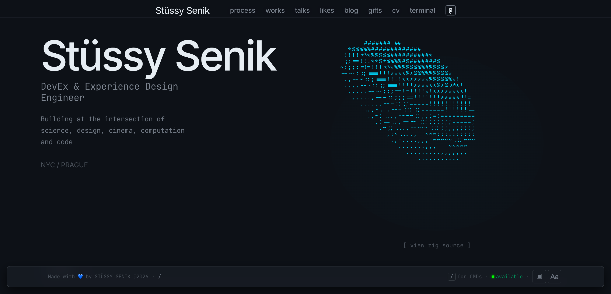
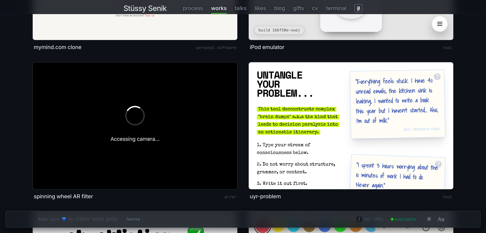
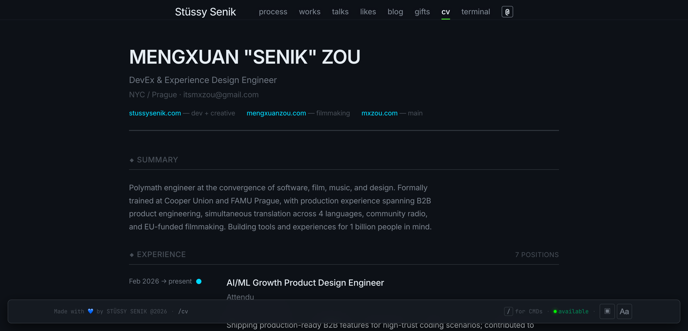
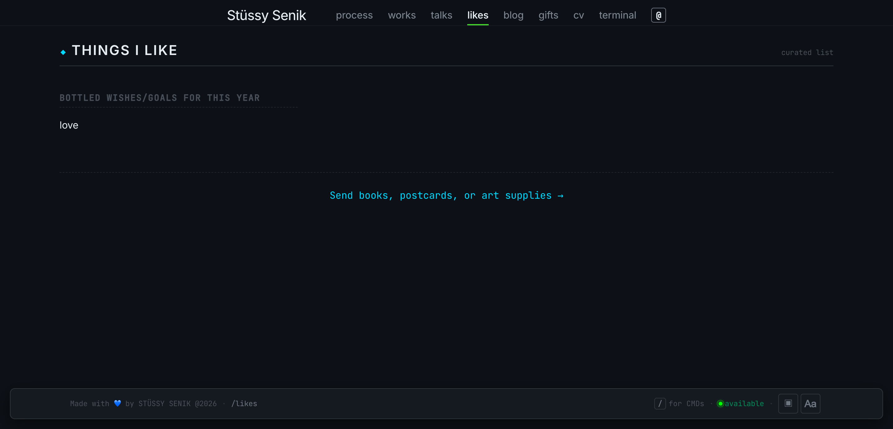
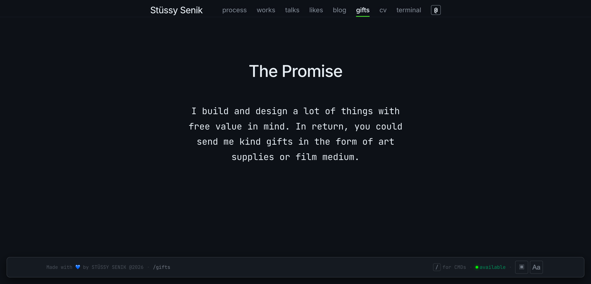

<div align="center">

# Portfolio Forever

### Personal portfolio with ASCII aesthetics


[Live Site](https://portfolio-forever.vercel.app)

</div>

---

Personal portfolio built with SvelteKit 5, Sanity CMS, and a terminal-inspired design system. ASCII aesthetics, intentional typography, and obsessive attention to spacing.

## Routes

| Route       | Description                        |
|-------------|------------------------------------|
| `/`         | Homepage — hero, works list, identity |
| `/works`    | 11 live project embeds + previews  |
| `/talks`    | Speaking engagements               |
| `/likes`    | Curated bookmarks                  |
| `/blog`     | Short notes (Sanity CMS)           |
| `/gifts`    | The Promise — creative exchange    |
| `/cv`       | Structured timeline + disciplines  |
| `/process`  | Behind-the-scenes methodology      |
| `/terminal` | CLI interface                      |

## Quick Start

```bash
bun install
cp .env.example .env.local  # Add Sanity credentials
bun run dev
```

## Design System

- **3 themes**: Accessible (WCAG AAA), Minimal, Terminal (dark)
- **Live font switching** between mono + sans stacks
- **Command palette** (`?` or `/`) with vim-style key sequences (`g w` → Works)
- **Golden ratio spacing** via design tokens (`--space-xs` to `--space-6xl`)
- **Responsive nav**: desktop shows "find me elsewhere" inline, mobile collapses to `@` toggle
- **Footer status bar**: floating, with theme/font controls opening upward

## Tech Stack

| Layer     | Technology                |
|-----------|---------------------------|
| Framework | SvelteKit 5 + TypeScript  |
| Styling   | Vanilla CSS (design tokens) |
| CMS       | Sanity (headless)         |
| Testing   | Playwright                |
| Build     | Vite 7                    |
| Deploy    | Vercel (static adapter)   |

## Testing

```bash
bun run dev                                        # Start dev server first
bunx playwright test tests/ui-polish.spec.ts       # UI polish tests
bunx playwright test tests/responsive/             # Mobile responsive tests
bunx playwright test                               # All 317 tests (8 files)
bunx playwright test --project=chromium            # Single browser
```

Tests cover: route health, nav hierarchy, hero responsiveness, command palette, works content, identity ordering, CV disciplines, gifts page, cross-breakpoint smoke, mobile /works loading & network (skeleton transitions, iframe suppression, preview images, 3G/4G throttling, viewport layouts, accessibility, performance).

## Screenshots

| Home | Works |
|------|-------|
|  |  |

| CV | Likes |
|----|-------|
|  |  |

| Gifts |
|-------|
|  |

## Structure

```
src/
├── lib/
│   ├── components/      # AsciiDonut, CommandPalette, ThemeSwitcher, FontSwitcher
│   ├── data/            # content.ts, cv.ts, layout-config.ts, tokens.ts
│   ├── sanity/          # CMS client & queries
│   └── utils/           # Overlap detector, helpers
└── routes/
    ├── blog/            # Sanity-powered notes
    ├── works/           # Live project showcases
    ├── cv/              # Structured timeline
    ├── gifts/           # The Promise page
    ├── likes/           # Curated bookmarks
    ├── talks/           # Speaking events
    ├── terminal/        # CLI interface
    └── process/         # Methodology
```

## License

Private project. All rights reserved.
