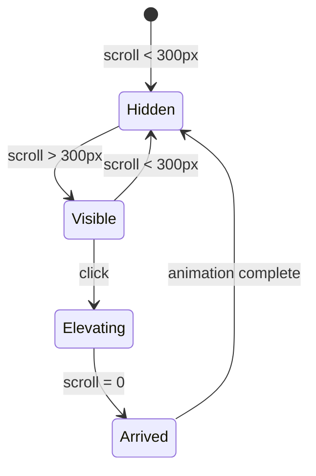

# Design Study: Elevator Component

> A case study in intentional interaction design for a "back to top" experience.

---

## 1. The Problem

**Standard "back to top" buttons are forgettable.**

They're typically:
- Generic arrow icon
- Instant scroll (no feedback)
- Purely functional, zero delight
- Disconnected from the site's visual language

**The opportunity:** Transform a mundane utility into a moment of delight that reinforces brand identity.

---

## 2. Design Principles Applied

### Don Norman's Principles

| Principle | Application |
|-----------|-------------|
| **Affordance** | The "↑ LOBBY" label signals purpose—it's an elevator panel, not just a button |
| **Feedback** | Live floor counter shows progress during the ride |
| **Mapping** | Floors decrease as you go up, matching elevator mental model |
| **Conceptual Model** | Entire interaction maps to "taking an elevator" |

### Rasmus Andersson / Linear Design

- **Typography-first**: No icons, pure type
- **Restraint**: Minimal animation, maximum meaning
- **Consistency**: Uses existing design tokens (`--font-mono`, `--border-color`, etc.)

### animation.dev / Framer Principles

- **State-driven**: Different visual for idle vs elevating
- **Purposeful motion**: Every animation communicates something
- **Duration scaling**: Animation time adapts to content length

---

## 3. Design Evolution

### Iteration 1: Generic (Rejected)
```
[ ▲ ]  🔊
```
**Problems:**
- Triangle doesn't communicate elevator
- Emoji breaks visual consistency
- No feedback during scroll

### Iteration 2: Text-based (Better)
```
↑ top  ♪
```
**Progress:**
- Uses typography
- Simpler
- But still generic

### Iteration 3: Elevator Panel (Final)
```
Idle:     [ ↑ ] LOBBY  ♪
Riding:   [ 7 ] going up  ♪
```
**Why it works:**
- Clear elevator metaphor
- Live state feedback
- Inverted display during ride (visual mode shift)
- Text changes reinforce the narrative

---

## 4. State Machine



### State Details

| State | Floor Display | Label | Sound |
|-------|---------------|-------|-------|
| Hidden | — | — | — |
| Visible | `↑` (arrow) | `LOBBY` | Ready |
| Elevating | `7`, `6`, `5`... | `going up` | Playing |
| Arrived | `0` → hide | — | Ding! |

---

## 5. Animation Decisions

### Duration Scaling Formula

```typescript
const baseDuration = 1500; // Minimum 1.5s
const scaleFactor = Math.sqrt(startPosition) * 30;
const duration = Math.min(baseDuration + scaleFactor, 6000);
```

**Why square root?**

| Distance | Linear (boring) | Square Root (ours) |
|----------|-----------------|-------------------|
| 400px | 1.0s | 2.1s |
| 1000px | 2.5s | 2.4s |
| 2000px | 5.0s | 2.8s |
| 5000px | 12.5s | 3.6s |

Square root prevents extremes: short scrolls don't feel rushed, long scrolls don't drag.

### Easing Function

```typescript
const eased = 1 - Math.pow(1 - progress, 3);
```

**Ease-out cubic**: Fast start, gentle arrival—like an elevator decelerating.

---

## 6. Micro-interactions

### Idle State
- **Hover on arrow**: Lifts 2px (hints at upward motion)
- **Hover on label**: Color shift to secondary

### Elevating State
- **Floor display inverts**: Background becomes text color (mode shift)
- **Floor numbers tick**: Each number animates in from above
- **Label pulses**: Subtle 1s opacity pulse

### Sound Toggle
- **Muted state**: Strikethrough + 0.3 opacity
- **Hover**: Border appears, color shifts

---

## 7. Accessibility Considerations

```svelte
<div
  role="button"
  tabindex="0"
  aria-label="Take elevator to top"
>
```

- Keyboard accessible (tabindex)
- Screen reader friendly (aria-label)
- Sound is optional (toggle)
- No nested buttons (HTML validity)

---

## 8. Design Token Integration

Every value references the existing system:

```css
font-family: var(--font-mono);
font-size: var(--font-size-2xs);
color: var(--color-text-muted);
border: 1px solid var(--border-color);
border-radius: var(--radius-sm);
padding: var(--space-xs) var(--space-sm);
transition: all var(--duration-fast) var(--easing);
```

**Result:** Component feels native to the site, not bolted on.

---

## 9. Mobile Considerations

```css
@media (max-width: 767px) {
  .elevator {
    bottom: calc(var(--space-sm) + 64px); /* Above terminal */
    right: var(--space-md);
    padding: var(--space-2xs) var(--space-xs);
  }
}
```

- Positioned above floating terminal
- Slightly smaller touch targets
- Same interaction model

---

## 10. Lessons for Future Components

### 1. Start with the Metaphor
Before coding, ask: "What real-world object does this remind me of?" 
Then commit to that metaphor fully.

### 2. Design All States First
Map out: idle → hover → active → loading → complete → error
Each state needs visual differentiation.

### 3. Use Your Design System
Never hardcode colors, fonts, or spacing. Components that use tokens age gracefully.

### 4. Scale Duration, Not Speed
For variable-length animations, use formulas (sqrt, log) rather than fixed durations.

### 5. Feedback > Decoration
Every animation should communicate state, progress, or confirmation.
Avoid animation for animation's sake.

### 6. Test Without Sound/Motion
The component should work without audio or reduced motion.
Delight is a bonus, not a requirement.

---

## 11. Files Created

| File | Purpose |
|------|---------|
| [Elevator.svelte](file:///home/senik/Desktop/portfolio-forever/src/lib/components/Elevator.svelte) | The component |
| [+page.svelte](file:///home/senik/Desktop/portfolio-forever/src/routes/+page.svelte) | Integration on home page |

---

## 12. References

- [Elevator.js](https://github.com/tholman/elevator.js) - Original inspiration
- [Don Norman's Design Principles](https://www.nngroup.com/articles/ten-usability-heuristics/)
- [Rasmus Andersson's Design Work](https://rsms.me/)
- [animation.dev](https://animation.dev) - Motion design patterns

---

*Document created: 2026-01-11*
