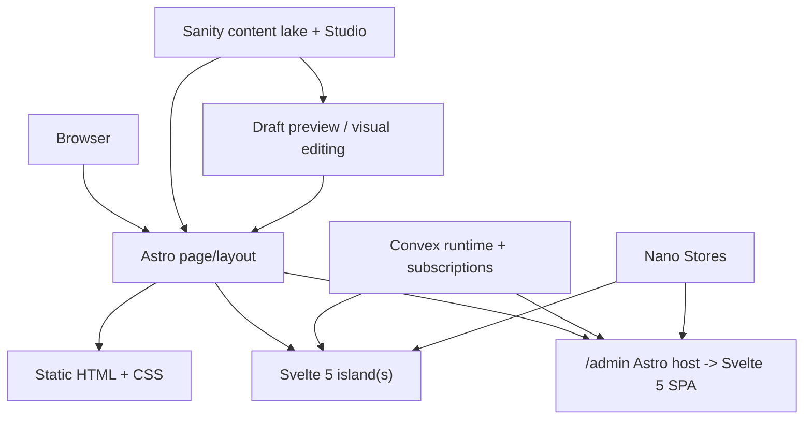

# Design: Astro Full Migration Foundation

## Context
This is not a “swap the router” change. It is a host-runtime inversion:
- Astro becomes the rendering shell.
- Svelte 5 becomes the island and SPA runtime.
- Sanity becomes the editorial archive and preview system.
- Convex remains the live composition and system layer.
- Nano Stores bridge local UI state across client boundaries.

The design challenge is keeping those boundaries crisp enough that the stack feels intentional rather than layered by accident.

## Target Architecture

## Decision 1: Astro is the only router

**Rejected:** keep SvelteKit for `/admin` and Astro for public pages.  
That creates two route systems, two layout models, and a long tail of CSS/state coordination work.

**Chosen:** Astro owns all routes.  
The public site is Astro-first. `/admin` is an Astro route that hydrates a Svelte 5 SPA.

Implications:
- Existing Svelte routes become Astro pages plus imported Svelte islands/components where needed.
- Global page transitions, metadata, and layout concerns move into Astro conventions.
- Admin routing inside the SPA can be local tab state or client-side routing, but the host route is Astro.

## Decision 2: Sanity owns atoms, Convex owns composition

This is the critical boundary.

**Sanity document examples**
- `profile`
- `heroContent`
- `caseStudy`
- `blogPost`
- `mediaAssetMetadata`
- SEO/title/description/open graph fields

**Convex document examples**
- pages and sections
- navigation visibility/order
- feature flags
- runtime widgets
- presence, claps, chat
- “Smalltalk” inspector/system state

Why this split works:
- Editorial versioning and draft workflows belong in Sanity.
- Runtime orchestration and instant live controls belong in Convex.
- The site can recompose content live without asking Sanity to become an application-state engine.

## Decision 3: Nano Stores are for client UI state only

Nano Stores should not become a second backend.

Use Nano Stores for:
- theme mode and font choice
- nav drawer/open state
- selected preview viewport
- admin shell tab selection
- lightweight preview-mode flags

Do not use Nano Stores for:
- canonical content
- persisted composition data
- multi-user shared state
- anything that Convex or Sanity already owns definitively

## Decision 4: Visual editing targets Astro-rendered pages

Visual editing should point at the actual public pages, not a synthetic editor preview. That means:
- Astro pages must support draft mode / preview context.
- Sanity overlays bind to content rendered on those Astro pages.
- “Edit” affordances jump to `/admin/content` for the corresponding document.

This keeps the preview loop honest: the thing being edited is the thing users will actually load.

## Decision 5: Admin is one shell, two domains

The admin should read as one tool with two responsibilities:
- **Editorial**
  Sanity Studio, structured authoring, document-level workflows.
- **System**
  Convex-backed controls, live site state, runtime features, diagnostics.

This avoids a false choice between “custom admin” and “use Studio.” Both exist, but in clearly-separated surfaces under a shared shell.

## Migration Sequence

### Step 1: Scaffold the Astro host
- Astro config
- Svelte integration
- top-level layout
- shared styles/assets
- one Astro-rendered homepage route

### Step 2: Prove the mixed data model
- Sanity-backed hero/profile content
- Convex-backed live badge/widget
- one Nano Store shared between layout and island

### Step 3: Port the admin shell
- `/admin` host route in Astro
- `/admin/content` Sanity Studio surface
- `/admin/system` mounted Svelte SPA

### Step 4: Port remaining routes incrementally
- works, blog, talks, cv, labs, etc.
- each route chooses static Astro, Svelte island, or live Convex behavior intentionally

## Open Questions Carried Forward

1. Should admin deep-linking use route segments (`/admin/content/blog/post-id`) or internal client state under `/admin/content` only?
   Proposed: route segments where practical, because visual-editing handoff is easier to reason about.

2. Should public page structure in Convex reference Sanity documents by IDs or by typed slugs/keys?
   Proposed: stable Sanity document references stored in Convex composition records, plus local denormalized labels where needed for admin ergonomics.

3. Should blog rendering be Astro static with preview exceptions, or fully server-rendered on request?
   Proposed: Astro static-by-default with draft/preview path support during editorial sessions.

## Non-Goals
- Rebuilding every existing route in one pass before the shell is proven
- Moving page composition into Sanity
- Replacing Convex with another backend
- Designing a generic CMS; this is a portfolio-specific system
