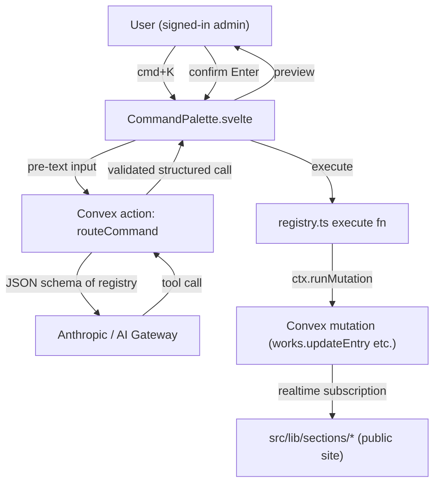

# Design: Command Palette OS

## Architecture



The flow has exactly one LLM call per user input and one Convex mutation per confirmed preview. The LLM only ever sees structured schemas; the client only ever sees server-validated payloads.

## Registry shape

```ts
// src/lib/command-os/registry.ts
import { z } from "zod";
import { api } from "../../../convex/_generated/api";
import type { ConvexClient } from "convex/browser";

export type ActionContext = { client: ConvexClient; goto: (path: string) => void };
export type ActionSpec<TArgs extends z.ZodTypeAny = z.ZodTypeAny> = {
  description: string;
  parameters: TArgs;
  execute: (args: z.infer<TArgs>, ctx: ActionContext) => Promise<unknown>;
};

export const registry = {
  updateWork: {
    description:
      "Update an existing work entry's title, URL, link label, or colors.",
    parameters: z.object({
      id: z.string(),
      title: z.string().optional(),
      url: z.string().url().optional(),
      linkLabel: z.string().optional(),
      styleOverrides: z
        .object({
          accentColor: z.string().optional(),
          httpColor: z.string().optional(),
          secondaryHighlight: z.string().optional(),
        })
        .partial()
        .optional(),
    }),
    execute: async (args, ctx) => {
      return await ctx.client.mutation(api.works.updateEntry, args);
    },
  },
  // … more entries
} as const satisfies Record<string, ActionSpec>;
```

One TypeScript object is the source of truth for: editor autocomplete, runtime validation, LLM tool-call schema, and refactor safety. Zod is non-negotiable because JSON Schema alone is not type-level.

## LLM prompt design

The Convex action `routeCommand` assembles a system prompt that:

1. Explains the model must call exactly one registry function — never free-form prose
2. Includes the registry's JSON schema via `zod-to-json-schema`
3. Provides the user's natural-language input as the user turn
4. Uses Anthropic's tool-calling (`tool_choice: { type: "any" }`) to force structured output

If the model emits text instead of a tool call, `routeCommand` returns `{ success: false, error: "model_refused_tool", message: string }`.

## Validation pipeline

1. LLM returns a tool-call object: `{ name: "updateWork", arguments: {...} }`
2. Look up `registry[name]`; if absent → `{ success: false, error: "unknown_action" }`
3. Parse `arguments` through `registry[name].parameters.safeParse(...)`
4. On parse failure → `{ success: false, error: "schema_validation_failed", zodIssues }`
5. On parse success → `{ success: true, action, args }` returned to the client for preview

**The client never trusts the LLM output directly** — only a server-validated payload.

## Preview state

Three-section preview before executing:

- **Action name** — human-readable version of the registry key (e.g. `updateWork` → "Update work entry")
- **Parameters** — pre-text formatted (monospace, no wrap), identifiers highlighted, values quoted
- **Affected rows** — for updates/deletes, the client fetches the current row(s) via the existing Convex query and renders a minimal diff

Confirm with Enter, cancel with Escape. Nothing persists until confirmation.

## Error surface

| Error | User-facing message | Recovery |
|---|---|---|
| `model_refused_tool` | "I couldn't map that to a known action. Be more specific." | Re-type |
| `unknown_action` | "That action isn't registered." | Re-type; link to action list |
| `schema_validation_failed` | Show the Zod error path + expected type | Re-type |
| Convex mutation error | Surface the mutation's own error message | Re-type or edit preview |
| Network / LLM timeout | "Command service is slow — try again" | Retry button |

## Static-site waiver justification

`openspec/project.md:48` commits to "no server-side runtime." Read narrowly, this forbids features that rely on code executing server-side to render the *public* portfolio. The command palette is:

- **Admin-gated** via Clerk auth — the public site never mounts or invokes it
- **Routed through Convex actions**, not a Node/SSR server
- **Observed only by the author**, not portfolio visitors

The public artifact remains fully static. The waiver is narrow in scope: it applies only to admin-gated, Clerk-authenticated, Convex-routed LLM calls. Any expansion of that scope (e.g. a public-facing LLM feature) would require a separate proposal and a separate waiver.

## Open questions

1. **Streaming vs. batch.** First-token streaming feels faster but complicates the preview state machine. **Recommendation:** batch for MVP, streaming in a follow-up.
2. **LLM provider.** Anthropic direct (one less layer) vs. Vercel AI Gateway (multi-provider, observability). **Recommendation:** Anthropic direct for MVP; switch to Gateway if multi-provider becomes a goal.
3. **Cache key normalization.** Exact-string LRU vs. case/whitespace-normalized. **Recommendation:** exact string for MVP; normalize later.
4. **Registry codegen.** Should mutation signatures auto-generate registry entries? **Recommendation:** no. The registry is a curated surface — not every mutation belongs in it. A lint rule that flags "new mutation without registry entry" is better than full codegen.
5. **Multi-table actions.** Do we ever want a single command to touch multiple tables? **Recommendation:** not in MVP. If the need emerges, a "recipe" layer on top of the registry is cleaner than letting individual entries touch multiple mutations.
6. **Combinatorial validator integration.** `controls-architecture.md:58` treats control combinations as a constraint satisfaction problem. Should cmd+K actions pass through that validator before execution? **Deferred to review.**
