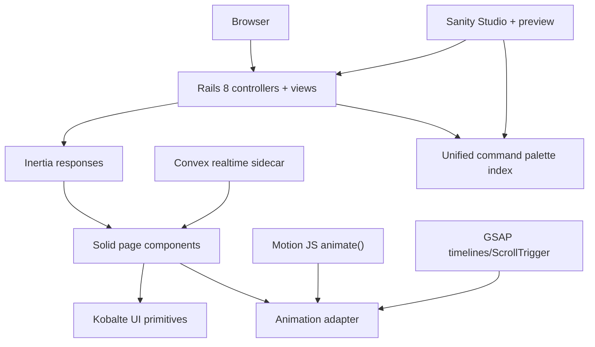

# Design: Precision Monolith Replatform

## Context
This change is not just “replace Astro with Rails.” The harder problem is preserving the strongest finished qualities already present in the repo and its reference deployments while simplifying the runtime boundary.

The plan therefore has two equal responsibilities:
1. recover authoritative provenance,
2. execute a host-runtime migration without flattening the portfolio.

## Current Truth vs Historical Truth

### Current truth
- Astro is the active host in `package.json`
- Svelte remains heavily used for interactive and legacy parity surfaces
- Convex and Sanity are both present in the live repo

### Historical truth
- SvelteKit + Squint/Clojure influenced the section/data architecture
- earlier Vercel deployments embody stronger finished patterns than any single current branch surface

### Target truth
- Rails 8 becomes the only host runtime on the replatform branch
- Inertia handles the transport boundary
- Solid owns interactive client rendering
- Kobalte provides accessible Solid-native primitives
- Convex handles shared live state only
- Sanity handles editorial content only

## Reference-Version Selection Model
To keep this migration mathematically disciplined, every major surface is chosen with the same weighted rubric instead of taste-only discussion.

### Scoring axes
- `finish` (30%): how complete and intentional the surface feels
- `clarity` (25%): how legible navigation and hierarchy are
- `density` (20%): how much useful signal is carried without clutter
- `portability` (15%): how safely it can be reused with minimal diff
- `live-fit` (10%): how well it accommodates Convex/Sanity/Rails boundaries

### Selection rule
For each surface, compute:

`score = 0.30*finish + 0.25*clarity + 0.20*density + 0.15*portability + 0.10*live_fit`

Use the highest-scoring version as the canonical base. Borrow secondary traits from lower-scoring versions only if they improve the base surface without increasing host complexity.

### Initial interpretation of the three reference deployments
- **Reference A**: strongest clean shell and works readability
- **Reference B**: strongest navigational hierarchy via the left rail
- **Reference C**: strongest homepage energy, showcase density, and command-surface feel

The target homepage should therefore be a superset:
- Reference B’s desktop navigation clarity
- Reference A’s readable ledger-like works treatment
- Reference C’s richer showcase/media energy where it truly adds signal

## Boundary Design

## Decision 1: Rails is the final host, not Vercel/Astro
The monolith branch should not preserve Astro as the production host. Astro remains part of the repository history and a migration reference, not the target runtime.

Implications:
- existing Astro pages become parity references during migration,
- routing and data loading move into Rails controllers and serializers,
- Vercel remains useful for frozen reference previews, not final architecture.

## Decision 2: Inertia removes the API glue layer
No standalone REST or GraphQL layer should be introduced for portfolio page composition.

Implications:
- Rails controllers pass typed page props directly,
- Solid components receive pre-shaped payloads,
- command-palette hydration and route transitions do not require duplicate client fetch layers by default.

## Decision 3: Solid is for interaction precision, not app sprawl
Solid should be used where its fine-grained updates matter:
- command palette
- live counters
- filtered works tables
- cursor/presence patterns
- media controls

Rejected:
- rebuilding every static content block as a reactive client widget

## Decision 3a: Kobalte is the primitive layer
Kobalte is the right primitive system for the Solid branch because it is Solid-native, accessible, and intentionally headless.

Use Kobalte for:
- command palette shell pieces,
- switches and checkboxes for feature flags,
- tabs/segmented controls for surface modes,
- menus, popovers, comboboxes, and navigation controls.

This keeps interaction semantics correct while leaving the visual language fully custom.

## Decision 3b: Motion and GSAP sit behind a tiny adapter
The goal is to feel both libraries in the real UI without coupling the whole app to one animation API too early.

Use:
- **Motion JS `animate()`** for light, direct, low-ceremony transitions and staggered reveals
- **GSAP timelines** for more orchestrated, scrubbed, or scroll-linked sequences

Important boundary:
- prefer Motion's framework-agnostic JavaScript API for the Solid stack,
- do not adopt Motion for React as a foundational dependency for Solid pages,
- keep both engines behind a route- or component-level adapter such as:
  - `animateIn`
  - `animateOut`
  - `animateHover`
  - `animateSequence`

This allows a Kobalte switch or segmented control in a lab/debug surface to swap engines for the same interaction and compare feel directly.

## Decision 4: Convex is a sidecar, not the portfolio database
Convex remains only where real-time shared state is clearly valuable:
- likes
- views
- presence
- multi-user cursors
- chat-like surfaces

Rejected:
- using Convex as the canonical content model for blog posts, case studies, CV, or page composition in the new monolith

## Decision 5: Sanity remains the editorial archive
Sanity keeps:
- case studies
- blog content
- profile text
- rich media metadata
- preview/editing workflow

Rails may cache or mirror only what is required for:
- search indexing,
- low-latency page props,
- stable build/runtime ergonomics.

## Minimal-Diff Implementation Rules
- Reuse existing naming, copy, and token systems unless the new host makes them invalid.
- Extract proven UI patterns before rewriting them in a new framework.
- Port route-by-route, not component-by-component in the abstract.
- Preserve current URLs unless there is a strong information-architecture reason to change them.
- Keep the visual language intentionally sharp; do not collapse into generic starter-kit layouts during the move.

## Migration Sequence

### Step 0: Provenance lock
- document current truth,
- create missing `PROGRESS.md`,
- inventory reference deployments and local branch state.

### Step 1: Toolchain lock
- upgrade Ruby,
- add toolchain files,
- confirm Rails 8 can boot reproducibly.

### Step 2: Skeleton monolith
- Rails app shell
- Inertia Rails adapter
- Solid entrypoint
- Vite wiring

### Step 3: Homepage proof
- port the canonical superset homepage,
- inject Rails props with existing content,
- connect one Convex live metric,
- implement one interaction behind the animation adapter with both Motion and GSAP variants,
- prove command palette indexing across Rails + Sanity content.

### Step 4: Route expansion
- works
- blog
- cv
- talks/process/likes/gifts/terminal as required by the canonical route map

### Step 5: Admin/editorial path
- keep Sanity editorial workflow,
- add Rails-side preview and command/search handoff,
- keep Convex-backed live controls isolated from editorial forms.

## Open Questions
1. Should the initial monolith live in this repo root or in a staged subdirectory before cutover?
   Proposed: start in-repo with a clearly isolated Rails app boundary only if the diff stays legible; otherwise use a dedicated branch and keep `main` stable.

2. Should the command palette index be fully Rails-local or partially denormalized from Sanity?
   Proposed: denormalize the searchable subset into Rails for fast initial payloads and stable production search.

3. Should desktop navigation keep the left rail globally or only on selected routes?
   Proposed: left rail on desktop where it improves orientation, but avoid forcing it onto content types that read better in a flat shell.

4. Should the animation-engine switch be production-visible or lab-only?
   Proposed: lab/debug-visible first, with a single default production engine selected per interaction after comparison.

## Non-Goals
- preserving Astro as a permanent co-host
- rebuilding the entire portfolio before provenance is documented
- introducing an API layer just because SPA tooling makes it easy
- porting every legacy experiment before the canonical public shell is proven
